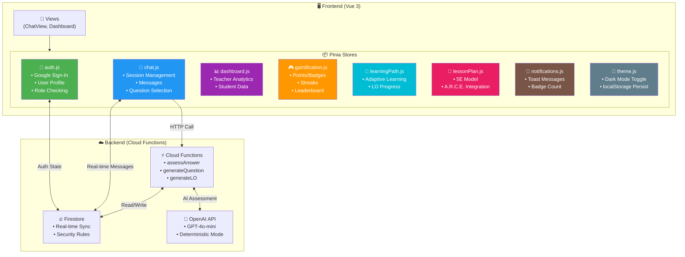
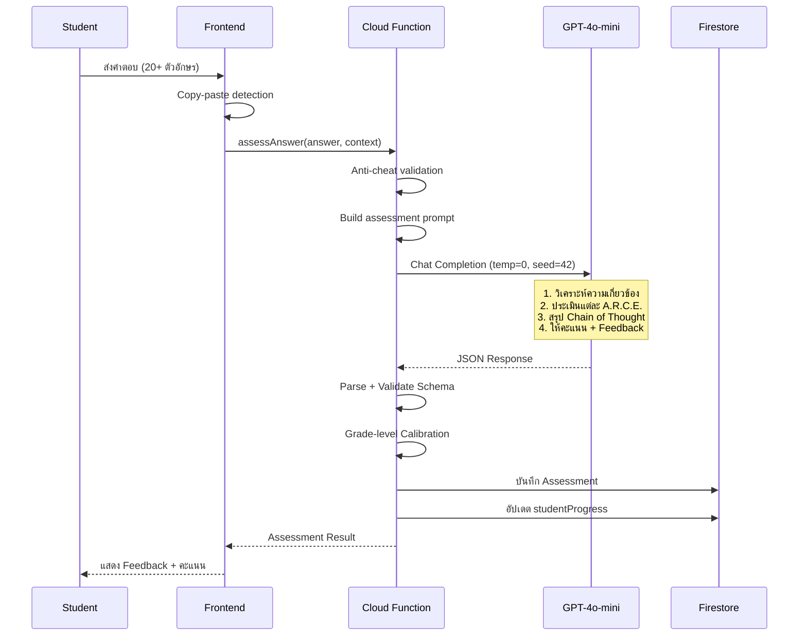
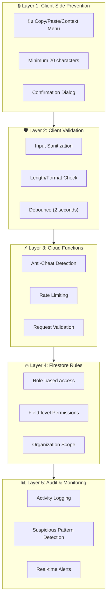
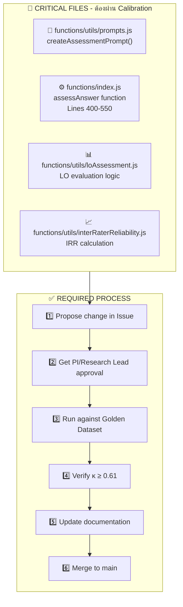
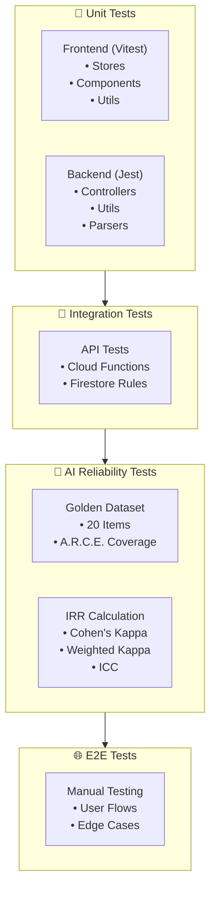
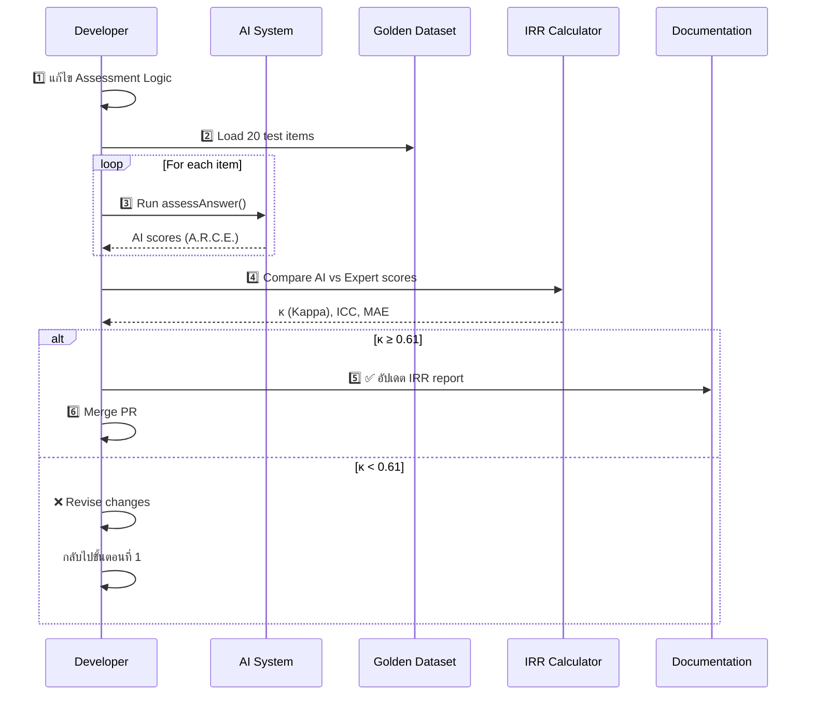
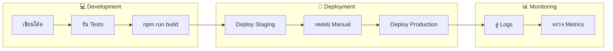

# 📖 HOTS AI ChatLoop - Developer Manual (v5.2)

> **คู่มือสำหรับนักพัฒนารุ่นต่อไป** — เอกสารนี้รวบรวมทุกสิ่งที่คุณต้องรู้เพื่อพัฒนา, Debug และ Deploy ระบบ HOTS AI ChatLoop

---

## 📑 สารบัญ

1. [🏗️ สถาปัตยกรรมและการออกแบบ](#-สถาปัตยกรรมและการออกแบบ)
2. [⚙️ การติดตั้งและสภาพแวดล้อม](#️-การติดตั้งและสภาพแวดล้อม)
3. [� มาตรฐานการเขียนโค้ด](#-มาตรฐานการเขียนโค้ด-coding-standards)
4. [🧪 ยุทธศาสตร์การทดสอบ](#-ยุทธศาสตร์การทดสอบ-testing-strategy)
5. [🚀 การขยายผลและดูแลรักษา](#-การขยายผลและดูแลรักษา-deployment--maintenance)
6. [🐛 Troubleshooting](#-troubleshooting-การแก้ปัญหาเชิงลึก)

---

## 🏗️ สถาปัตยกรรมและการออกแบบ

### 1.1 Monorepo Structure

โปรเจกต์นี้ใช้รูปแบบ **Monorepo** — เก็บทั้ง Frontend และ Backend ไว้ใน Repository เดียว เพื่อให้ง่ายต่อการจัดการ Version และ Dependency

```
hots-ai/
├── 📁 src/                    # 🖥️ FRONTEND (Vue 3 + Vite)
│   ├── components/            # Reusable UI Components
│   ├── views/                 # Page-level Components
│   ├── stores/                # Pinia State Management (8 stores)
│   ├── router/                # Vue Router Configuration
│   ├── composables/           # Vue Composition API Hooks
│   ├── firebase/              # Firebase Client SDK Config
│   ├── utils/                 # Helper Functions
│   └── styles/                # Global CSS + Dark Mode
│
├── 📁 functions/              # ☁️ BACKEND (Cloud Functions)
│   ├── index.js               # Main Entry (10,000+ lines) - AI Logic หลัก
│   ├── controllers/           # Business Logic แยกตาม Domain
│   ├── services/              # External Service Integrations
│   ├── utils/                 # Shared Utilities (Parser, Validators)
│   ├── __tests__/             # Jest Unit Tests
│   └── package.json           # Node.js 20 Dependencies
│
├── 📁 docs/                   # 📚 Academic Documentation
├── 📁 public/                 # Static Assets
├── firebase.json              # Firebase Project Config
├── firestore.rules            # Security Rules (800+ lines)
└── firestore.indexes.json     # Composite Indexes
```

> 💡 **Tip สำหรับน้องใหม่**: เมื่อแก้ไขโค้ด ให้ระวังว่า Frontend (`src/`) และ Backend (`functions/`) มี `package.json` แยกกัน — ต้องลง dependencies แยกกันด้วย!

---

### 1.2 State Management — Pinia Stores

ระบบใช้ **Pinia** (ตัวจัดการ State อย่างเป็นทางการของ Vue 3) แทน Vuex เพราะมี TypeScript support ที่ดีกว่าและ Syntax กระชับกว่า

#### 📊 แผนภาพ Data Flow



#### 🗂️ Store Reference Table

| Store | ไฟล์ | หน้าที่หลัก | Collections ที่เกี่ยวข้อง |
|-------|------|------------|-------------------------|
| **Auth** | `auth.js` | จัดการ Authentication, Role-based Access | `users` |
| **Chat** | `chat.js` | Session lifecycle, Question selection algorithm | `sessions`, `messages`, `assessments` |
| **Dashboard** | `dashboard.js` | รวมข้อมูล Analytics สำหรับครู | `users`, `assessments`, `courses` |
| **Gamification** | `gamification.js` | ระบบ Points, Badges, Streaks | `userStats`, `achievements` |
| **LearningPath** | `learningPath.js` | Adaptive learning, LO tracking | `studentProgress`, `learningPaths` |
| **LessonPlan** | `lessonPlan.js` | จัดการแผนการสอน 5E + A.R.C.E. | `lessonPlans` |
| **Notifications** | `notifications.js` | Toast messages, Badge count | — (in-memory) |
| **Theme** | `theme.js` | Dark mode, Persist ใน localStorage | — (localStorage) |

---

### 1.3 Deterministic AI Engine 🧠

**หัวใจสำคัญของงานวิจัย** — ระบบใช้ GPT-4o-mini ในโหมด **Deterministic** เพื่อให้ผลการประเมินคงที่และวัดผลได้

#### ⚙️ Configuration ที่สำคัญ

```javascript
// functions/index.js - Line 460-470
const completion = await openai.chat.completions.create({
  model: 'gpt-4o-mini',
  messages: [/* ... */],
  
  // 🎯 DETERMINISTIC SETTINGS
  temperature: 0,    // ❄️ Zero temperature = ไม่มี Randomness
  seed: 42,          // 🌱 Fixed seed = ผลลัพธ์ซ้ำได้ (Reproducible)
  
  max_tokens: 1500   // Chain of Thought ต้องการ tokens มากขึ้น
})
```

#### 🔬 ทำไมต้อง Deterministic?

| ปัจจัย | ค่าปกติ | ค่าที่เราใช้ | เหตุผล |
|--------|---------|-------------|--------|
| `temperature` | 0.7-1.0 | **0** | ลด Variance ของคะแนน, เพิ่ม Inter-Rater Reliability |
| `seed` | random | **42** | ให้ผลลัพธ์ซ้ำได้สำหรับการ Audit และ Regression Test |
| `max_tokens` | 500 | **1500** | รองรับ Chain of Thought reasoning |

#### 🔄 Chain of Thought (CoT) Flow



#### ⚠️ คำเตือนสำคัญ

> 🚨 **RESEARCH INTEGRITY NOTICE**
> 
> การแก้ไขค่า `temperature`, `seed`, หรือ Prompt ใน `createAssessmentPrompt()` 
> **จะส่งผลกระทบต่อค่า Inter-Rater Reliability (IRR)** ของงานวิจัย
> 
> **ก่อนแก้ไข ต้อง:**
> 1. ทำ Calibration Study ใหม่
> 2. ตรวจสอบกับ Golden Dataset
> 3. อัปเดตเอกสาร IRR ใน `GOLDEN_DATASET_IRR.md`

---

### 1.4 Security Layer — 5 ชั้นป้องกัน 🔐

ระบบมีกลไกรักษาความปลอดภัยแบบ **Defense in Depth** — 5 ชั้นซ้อนกัน



#### 📋 รายละเอียดแต่ละชั้น

| Layer | ที่ตั้ง | กลไก | ตัวอย่างโค้ด |
|-------|-------|------|-------------|
| **1. Client Prevention** | `ChatView.vue` | `@paste.prevent`, `@copy.prevent` | ป้องกันการ Copy คำตอบคนอื่น |
| **2. Client Validation** | Vue Components | Regex, Length check, Debounce | `answer.length >= 20` |
| **3. Cloud Functions** | `index.js` | `detectCopyPaste()`, Rate limiter | ตรวจจับ spacing ผิดปกติ |
| **4. Firestore Rules** | `firestore.rules` | `isTeacher()`, `isOwner()` | ครูเท่านั้นแก้ไข Questions |
| **5. Audit Trail** | `antiCheatLogs` | Logging + Alerts | บันทึกพฤติกรรมที่น่าสงสัย |

#### 🔑 Firestore Rules — Role Hierarchy

```javascript
// firestore.rules - Helper Functions
function isStudent() {
  return isSignedIn() && getUserRole() == 'student';
}

function isTeacher() {
  return isSignedIn() && getUserRole() == 'teacher';
}

function isSchoolAdmin() {
  return isSignedIn() && getUserRole() == 'school_admin';
}

function isESAAdmin() {
  return isSignedIn() && getUserRole() == 'esa_admin';
}

function isMinistryAdmin() {
  return isSignedIn() && getUserRole() == 'ministry_admin';
}

// Organization-scoped Access
function canAccessSchool(schoolId) {
  return isMinistryAdmin() || 
         (isESAAdmin() && /* ESA matches */) ||
         (isSchoolAdmin() && isSameSchool(schoolId));
}
```

---

## ⚙️ การติดตั้งและสภาพแวดล้อม

### 2.1 Prerequisites

ก่อนเริ่มต้น ตรวจสอบว่าติดตั้งสิ่งเหล่านี้แล้ว:

| เครื่องมือ | Version | ตรวจสอบด้วย | หมายเหตุ |
|-----------|---------|-------------|---------|
| **Node.js** | 20.x LTS | `node -v` | ⚠️ Functions ต้องการ Node 20 เท่านั้น |
| **npm** | 10.x+ | `npm -v` | มาพร้อม Node.js |
| **Java** | 11+ | `java -version` | สำหรับ Firebase Emulators |
| **Firebase CLI** | Latest | `firebase --version` | `npm i -g firebase-tools` |
| **Git** | Any | `git --version` | Version control |

> 💡 **Tip**: ใช้ [nvm](https://github.com/nvm-sh/nvm) เพื่อจัดการหลาย Node.js versions

```bash
# ติดตั้ง Node 20 ผ่าน nvm
nvm install 20
nvm use 20
```

---

### 2.2 Installation Steps

```bash
# 1️⃣ Clone repository
git clone https://github.com/saengpech-sys/hots-ai.git
cd hots-ai

# 2️⃣ ติดตั้ง Frontend dependencies
npm install

# 3️⃣ ติดตั้ง Backend dependencies
cd functions
npm install
cd ..

# 4️⃣ ตั้งค่า Firebase project
firebase login
firebase use --add  # เลือก project ที่ต้องการ

# 5️⃣ สร้างไฟล์ Environment Variables (ดูหัวข้อถัดไป)
cp .env.example .env
cp functions/.env.example functions/.env
```

---

### 2.3 Environment Variables

#### 📁 Frontend — `.env` (Root Directory)

```bash
# Firebase Configuration
VITE_FIREBASE_API_KEY=AIza...
VITE_FIREBASE_AUTH_DOMAIN=your-project.firebaseapp.com
VITE_FIREBASE_PROJECT_ID=your-project-id
VITE_FIREBASE_STORAGE_BUCKET=your-project.appspot.com
VITE_FIREBASE_MESSAGING_SENDER_ID=123456789
VITE_FIREBASE_APP_ID=1:123456789:web:abc123

# Cloud Functions URL (Production)
VITE_FUNCTIONS_URL=https://us-central1-your-project.cloudfunctions.net

# Development mode
VITE_USE_EMULATORS=false  # true สำหรับ local development
```

#### 📁 Backend — `functions/.env`

```bash
# OpenAI Configuration
OPENAI_API_KEY=sk-proj-...

# Model Selection (สำคัญมาก!)
OPENAI_MODEL=gpt-4o-mini  # ⚠️ ห้ามเปลี่ยนเป็น gpt-4o โดยไม่จำเป็น (ราคาแพงกว่า 15-20x)

# Optional: Rate Limiting
RATE_LIMIT_WINDOW_MS=60000
RATE_LIMIT_MAX_REQUESTS=10
```

#### 🔐 Firebase Service Account

สำหรับ Local Development, ต้องมีไฟล์ `functions/serviceAccountKey.json`:

```bash
# วิธีได้มา:
# 1. ไปที่ Firebase Console → Project Settings → Service Accounts
# 2. คลิก "Generate new private key"
# 3. บันทึกเป็น functions/serviceAccountKey.json
```

> ⚠️ **NEVER COMMIT `serviceAccountKey.json` TO GIT!** — ไฟล์นี้อยู่ใน `.gitignore` แล้ว

---

### 2.4 Local Development — Emulator Suite

Firebase Emulator Suite ช่วยให้รันระบบจำลองบนเครื่อง โดยไม่ต้องใช้ Production resources

```bash
# Terminal 1: รัน Backend Emulators
cd functions
npm run serve
# หรือ: firebase emulators:start --only functions,firestore,auth

# Terminal 2: รัน Frontend Dev Server
npm run dev
```

#### 🖥️ Emulator UI

เมื่อ Emulators ทำงาน จะเข้าถึงได้ที่:

| Service | URL | ใช้ทำอะไร |
|---------|-----|----------|
| **Emulator UI** | http://localhost:4000 | Dashboard รวม |
| **Firestore** | http://localhost:8080 | ดู/แก้ไขข้อมูล |
| **Auth** | http://localhost:9099 | จัดการ Users |
| **Functions** | http://localhost:5001 | ดู Logs |
| **Frontend** | http://localhost:5173 | Vue Dev Server |

#### 🔧 เปิดใช้ Emulators ใน Frontend

แก้ไข `.env`:

```bash
VITE_USE_EMULATORS=true
```

หรือแก้ไขใน `src/firebase/config.js`:

```javascript
// ตรวจสอบว่าใช้ Emulators หรือไม่
if (import.meta.env.VITE_USE_EMULATORS === 'true') {
  connectAuthEmulator(auth, 'http://localhost:9099')
  connectFirestoreEmulator(db, 'localhost', 8080)
}
```

---

### 2.5 Quick Reference — NPM Scripts

#### Frontend (`package.json`)

| Command | คำอธิบาย |
|---------|---------|
| `npm run dev` | รัน Vite dev server (port 5173) |
| `npm run build` | Build production bundle |
| `npm run preview` | Preview production build |
| `npm run test` | รัน Vitest unit tests |
| `npm run test:watch` | รัน tests ในโหมด watch |
| `npm run test:coverage` | รัน tests พร้อม coverage report |

#### Backend (`functions/package.json`)

| Command | คำอธิบาย |
|---------|---------|
| `npm run serve` | รัน Functions emulator |
| `npm run deploy` | Deploy functions to production |
| `npm run logs` | ดู logs จาก production |
| `npm run test` | รัน Jest unit tests |
| `npm run test:watch` | รัน tests ในโหมด watch |
| `npm run test:coverage` | รัน tests พร้อม coverage report |

#### Firebase CLI

| Command | คำอธิบาย |
|---------|---------|
| `firebase deploy` | Deploy ทุกอย่าง |
| `firebase deploy --only hosting` | Deploy frontend เท่านั้น |
| `firebase deploy --only functions` | Deploy functions เท่านั้น |
| `firebase deploy --only firestore:rules` | Deploy security rules |
| `firebase deploy --only firestore:indexes` | Deploy composite indexes |

---

## � มาตรฐานการเขียนโค้ด (Coding Standards)

### 3.1 Naming Conventions

ระบบใช้รูปแบบการตั้งชื่อที่สอดคล้องกันตลอดทั้ง Codebase เพื่อให้อ่านง่ายและบำรุงรักษาได้

#### 📁 Files & Folders

| ประเภท | รูปแบบ | ตัวอย่าง |
|--------|--------|---------|
| **Vue Components** | PascalCase | `ChatView.vue`, `QuestionCard.vue` |
| **Pinia Stores** | camelCase | `auth.js`, `learningPath.js` |
| **Cloud Functions** | camelCase | `assessmentController.js` |
| **Utilities** | camelCase | `aiParser.js`, `rateLimiter.js` |
| **Test Files** | `*.test.js` | `aiParser.test.js`, `auth.test.js` |
| **Constants** | SCREAMING_SNAKE (ใน file) | `constants/scoring.js` |

#### 📝 Variables & Functions

```javascript
// ✅ GOOD - ตัวอย่างที่ถูกต้อง

// Variables: camelCase
const studentAnswer = 'คำตอบนักเรียน'
const rubricScores = { analysis: 4, reasoning: 3 }
const isAuthenticated = true

// Functions: camelCase, verb-first
function calculateCohensKappa(scores1, scores2) { }
function validateRubricScores(scores) { }
async function fetchStudentProgress(studentId) { }

// Constants: SCREAMING_SNAKE_CASE
const MAX_RETRY_ATTEMPTS = 3
const OPENAI_MODEL = 'gpt-4o-mini'
const RATE_LIMIT_WINDOW_MS = 60000

// Booleans: is/has/can/should prefix
const isTeacher = userProfile.role === 'teacher'
const hasCompletedAssessment = assessments.length > 0
const canEditQuestion = isTeacher && isOwner

// Event Handlers: handle + noun + verb
function handleFormSubmit() { }
function handleMessageSend() { }
function handleAnswerConfirm() { }
```

```javascript
// ❌ BAD - ตัวอย่างที่ไม่ควรทำ

// ❌ ใช้ abbreviations ที่ไม่ชัดเจน
const stdAns = 'คำตอบ'        // ✅ ใช้ studentAnswer
const rs = { a: 4, r: 3 }     // ✅ ใช้ rubricScores

// ❌ ชื่อกว้างเกินไป
function process(data) { }    // ✅ ใช้ processAssessmentResult(data)
const info = await fetch()    // ✅ ใช้ studentInfo = await fetch()

// ❌ ใช้ภาษาไทยในชื่อตัวแปร
const คะแนน = 15              // ✅ ใช้ score = 15
```

#### 🏷️ Firestore Collections

| Collection | Document ID Format | ตัวอย่าง |
|------------|-------------------|---------|
| `users` | Firebase Auth UID | `abc123xyz...` |
| `courses` | Auto-generated | `course_abc123` |
| `sessions` | Auto-generated | `session_def456` |
| `assessments` | Auto-generated | `assessment_ghi789` |
| `studentProgress` | `{studentId}_{courseId}` | `user123_course456` |
| `goldenDataset` | `GD-{number}` | `GD-001`, `GD-020` |

---

### 3.2 A.R.C.E. Logic Rules — กฎเหล็กงานวิจัย ⚠️

> 🚨 **CRITICAL SECTION — อ่านก่อนแก้โค้ดที่เกี่ยวกับ AI**

A.R.C.E. (Analysis, Reasoning, Creativity, Evidence) คือ Framework การประเมิน HOTS ที่เป็นหัวใจของงานวิจัย การแก้ไข Logic เหล่านี้โดยพลการจะทำให้ **ค่า IRR (Inter-Rater Reliability) เปลี่ยน** และต้องทำ Calibration Study ใหม่ทั้งหมด!

#### 🔒 ไฟล์ที่ห้ามแก้โดยไม่ผ่านกระบวนการ



#### 📋 Checklist ก่อนแก้ไข Assessment Logic

```markdown
## Pre-Change Checklist

- [ ] เขียน Issue อธิบายเหตุผลที่ต้องแก้ไข
- [ ] ได้รับอนุมัติจาก Principal Investigator
- [ ] Backup ค่า IRR ปัจจุบัน
- [ ] เตรียม Golden Dataset (20 items)
- [ ] มี Expert 2-3 คนพร้อมประเมิน

## Post-Change Checklist

- [ ] รัน IRR Test ผ่าน (κ ≥ 0.61)
- [ ] อัปเดต GOLDEN_DATASET_IRR.md
- [ ] อัปเดต docs/04_RESEARCH_METHODOLOGY.md
- [ ] สร้าง Git tag: `irr-calibration-YYYYMMDD`
```

#### 🔄 Frontend/Backend Parity Check

ต้องตรวจสอบว่า Logic การประเมินใน Frontend และ Backend ตรงกัน:

```javascript
// 📁 functions/utils/prompts.js (Backend)
// A.R.C.E. Scoring Criteria

const ARCE_CRITERIA = {
  analysis: {
    name: 'การวิเคราะห์',
    maxScore: 5,
    anchors: {
      5: 'แยกแยะประเด็นครบถ้วน ชี้ความสัมพันธ์ซับซ้อน',
      4: 'แยกแยะประเด็นส่วนใหญ่ ชี้ความสัมพันธ์ได้ดี',
      3: 'แยกแยะประเด็นหลักได้ ชี้ความสัมพันธ์พื้นฐาน',
      2: 'แยกแยะบางประเด็น ขาดความสัมพันธ์',
      1: 'พยายามแยกแยะแต่ยังไม่ชัดเจน',
      0: 'ไม่มีหลักฐานการวิเคราะห์'
    }
  },
  reasoning: { /* ... */ },
  creativity: { /* ... */ },
  evidence: { /* ... */ }
}
```

```javascript
// 📁 src/constants/scoring.js (Frontend) - ต้องตรงกัน!
// ใช้แสดงให้นักเรียนเห็นว่าถูกประเมินอย่างไร

export const ARCE_CRITERIA = {
  // ... ต้องเหมือนกับ Backend ทุกประการ
}

// 🔍 PARITY TEST: เขียน unit test เช็คว่าตรงกัน
// ดู src/__tests__/scoring.test.js
```

---

### 3.3 Error Handling Standards

#### 🔥 Backend — Cloud Functions

ใช้ **Structured Logger** และ **HttpsError** อย่างสม่ำเสมอ:

```javascript
// 📁 functions/utils/logger.js
const logger = require('./utils/logger')

// ✅ GOOD - Structured logging
logger.info('Assessment started', {
  studentId: 'user123',
  sessionId: 'session456',
  questionId: 'q789'
})

logger.error('OpenAI API failed', error, {
  studentId: 'user123',
  retryCount: 2,
  model: 'gpt-4o-mini'
})

// ✅ GOOD - HttpsError for client-facing errors
const functions = require('firebase-functions')

// Authentication error
if (!context.auth) {
  throw new functions.https.HttpsError(
    'unauthenticated',
    'User must be authenticated'
  )
}

// Permission error
if (userRole !== 'teacher') {
  throw new functions.https.HttpsError(
    'permission-denied',
    'Only teachers can access this resource'
  )
}

// Validation error
if (!studentId || !courseId) {
  throw new functions.https.HttpsError(
    'invalid-argument',
    'studentId and courseId are required'
  )
}

// Internal error (log details, return generic message)
try {
  await riskyOperation()
} catch (error) {
  logger.error('Operation failed', error, { context: 'details' })
  throw new functions.https.HttpsError(
    'internal',
    'An unexpected error occurred. Please try again.'
  )
}
```

#### 📊 HttpsError Codes Reference

| Code | HTTP Status | ใช้เมื่อ |
|------|-------------|---------|
| `unauthenticated` | 401 | ไม่ได้ login |
| `permission-denied` | 403 | ไม่มีสิทธิ์เข้าถึง |
| `invalid-argument` | 400 | Input ไม่ถูกต้อง |
| `not-found` | 404 | ไม่พบ resource |
| `already-exists` | 409 | ข้อมูลซ้ำ |
| `resource-exhausted` | 429 | Rate limit exceeded |
| `internal` | 500 | Error อื่นๆ (ไม่บอกรายละเอียด) |

#### 🖥️ Frontend — Vue Components

```javascript
// ✅ GOOD - Centralized error handling

// 📁 src/utils/errorHandler.js
export function handleAPIError(error, context = '') {
  const errorCode = error.code || 'unknown'
  const errorMessage = error.message || 'เกิดข้อผิดพลาด'
  
  // Log for debugging (dev only)
  if (import.meta.env.DEV) {
    console.error(`[${context}] Error:`, error)
  }
  
  // User-friendly messages
  const messages = {
    'unauthenticated': 'กรุณาเข้าสู่ระบบใหม่',
    'permission-denied': 'คุณไม่มีสิทธิ์เข้าถึงข้อมูลนี้',
    'invalid-argument': 'ข้อมูลไม่ถูกต้อง กรุณาตรวจสอบอีกครั้ง',
    'resource-exhausted': 'กรุณารอสักครู่แล้วลองใหม่',
    'internal': 'ระบบขัดข้อง กรุณาลองใหม่ภายหลัง'
  }
  
  return messages[errorCode] || errorMessage
}

// Usage in component
import { handleAPIError } from '@/utils/errorHandler'
import { useNotificationStore } from '@/stores/notifications'

const notifications = useNotificationStore()

try {
  await submitAnswer()
} catch (error) {
  notifications.showError(handleAPIError(error, 'submitAnswer'))
}
```

---

## 🧪 ยุทธศาสตร์การทดสอบ (Testing Strategy)

### 4.1 Testing Overview



---

### 4.2 Frontend Testing — Vitest

#### 📋 Commands

```bash
# รันทุก test
npm run test

# รันแบบ watch mode (ระหว่าง dev)
npm run test:watch

# รันพร้อม coverage report
npm run test:coverage

# รัน test เฉพาะไฟล์
npm run test -- auth.test.js
```

#### 📁 Test Structure

```
src/__tests__/
├── auth.test.js           # Auth store tests
├── gamification.test.js   # Points/badges logic
├── loProgress.test.js     # LO tracking tests
└── errorHandler.test.js   # Error handling utils
```

#### ✅ Example Test

```javascript
// 📁 src/__tests__/auth.test.js
import { describe, test, expect, beforeEach } from 'vitest'
import { setActivePinia, createPinia } from 'pinia'
import { useAuthStore } from '@/stores/auth'

describe('Auth Store', () => {
  beforeEach(() => {
    setActivePinia(createPinia())
  })

  describe('Role Checks', () => {
    test('isStudent should return true for student role', () => {
      const store = useAuthStore()
      store.userProfile = { role: 'student' }
      
      expect(store.isStudent).toBe(true)
      expect(store.isTeacher).toBe(false)
    })

    test('isTeacher should return true for teacher role', () => {
      const store = useAuthStore()
      store.userProfile = { role: 'teacher' }
      
      expect(store.isTeacher).toBe(true)
      expect(store.isStudent).toBe(false)
    })
  })
})
```

---

### 4.3 Backend Testing — Jest

#### 📋 Commands

```bash
cd functions

# รันทุก test
npm run test

# รันแบบ watch mode
npm run test:watch

# รันพร้อม coverage report
npm run test:coverage

# รัน test เฉพาะไฟล์
npm run test -- aiParser.test.js
```

#### 📁 Test Structure

```
functions/__tests__/
├── aiParser.test.js           # AI response cleaning/parsing
├── loAssessment.test.js       # LO evaluation logic
├── prompts.test.js            # Prompt generation
├── rateLimiter.test.js        # Rate limiting logic
├── qualityAssurance.test.js   # QA utilities
├── generationController.test.js
├── researchController.test.js
├── systemController.test.js
└── worksheetController.test.js
```

#### ✅ Example Test — AI Parser

```javascript
// 📁 functions/__tests__/aiParser.test.js
const {
  cleanAIResponse,
  safeParseJSON,
  validateRubricScores
} = require('../utils/aiParser')

describe('cleanAIResponse', () => {
  test('should remove ```json wrapper', () => {
    const input = '```json\n{"test": "value"}\n```'
    const result = cleanAIResponse(input)
    expect(result).toBe('{"test": "value"}')
  })

  test('should handle complex nested JSON with Thai text', () => {
    const input = '```json\n{"rubricScores": {"analysis": 4}, "feedback": "ดี"}\n```'
    const result = cleanAIResponse(input)
    expect(JSON.parse(result)).toEqual({
      rubricScores: { analysis: 4 },
      feedback: "ดี"
    })
  })

  test('should handle empty input gracefully', () => {
    expect(cleanAIResponse('')).toBe('')
    expect(cleanAIResponse(null)).toBe('')
    expect(cleanAIResponse(undefined)).toBe('')
  })
})

describe('validateRubricScores', () => {
  test('should accept valid scores 0-5', () => {
    const scores = { analysis: 4, reasoning: 3, creativity: 5, evidence: 2 }
    expect(validateRubricScores(scores)).toBe(true)
  })

  test('should reject scores outside 0-5 range', () => {
    const scores = { analysis: 6, reasoning: -1 }
    expect(validateRubricScores(scores)).toBe(false)
  })
})
```

---

### 4.4 AI Reliability Testing — Golden Dataset 🎯

> **นี่คือส่วนที่สำคัญที่สุดสำหรับ Research Integrity**

#### 📊 Golden Dataset คืออะไร?

ชุดข้อมูลมาตรฐาน **20 items** ที่ถูกประเมินโดย **Expert 2-3 คน** ใช้สำหรับ:
1. **Calibration** — ปรับเทียบ AI กับ Human raters
2. **IRR Measurement** — วัด Inter-Rater Reliability
3. **Regression Testing** — ตรวจสอบว่าการแก้ไขไม่ทำให้คุณภาพลดลง

#### 📁 ที่อยู่ของ Golden Dataset

| Location | คำอธิบาย |
|----------|---------|
| `GOLDEN_DATASET_IRR.md` | เอกสาร 20 items + Expert scores |
| Firestore: `goldenDataset` | Collection สำหรับ runtime access |
| `functions/utils/interRaterReliability.js` | IRR calculation logic |

#### 🔄 IRR Testing Workflow



#### 📋 ขั้นตอนการรัน IRR Test

```bash
# 1️⃣ เตรียม Environment
cd functions
cp .env.example .env  # ใส่ OPENAI_API_KEY

# 2️⃣ รัน IRR Test Script
npm run test:irr

# หรือ manual:
node scripts/run-irr-test.js

# 3️⃣ ดูผลลัพธ์
cat reports/irr-results-YYYYMMDD.json
```

#### 🎯 IRR Metrics และเกณฑ์การผ่าน

```javascript
// 📁 functions/utils/interRaterReliability.js

// Kappa Interpretation (Landis & Koch, 1977)
function interpretKappa(kappa) {
  if (kappa < 0)    return 'Poor (Less than chance)'
  if (kappa < 0.20) return 'Slight'
  if (kappa < 0.40) return 'Fair'
  if (kappa < 0.60) return 'Moderate'     // ⚠️ Below threshold
  if (kappa < 0.80) return 'Substantial'  // ✅ MINIMUM for publication
  return 'Almost Perfect'                  // ✅ Excellent
}

// Publication Standard Check
function meetsPublicationStandard(weightedKappa, icc) {
  return weightedKappa >= 0.61 && icc >= 0.75
}
```

| Metric | เกณฑ์ขั้นต่ำ | เป้าหมาย | คำอธิบาย |
|--------|------------|---------|---------|
| **Cohen's Kappa (κ)** | ≥ 0.61 | ≥ 0.80 | Agreement ระหว่าง AI และ Expert |
| **Weighted Kappa (κw)** | ≥ 0.61 | ≥ 0.80 | เหมาะกับ ordinal scale (0-5) |
| **ICC** | ≥ 0.75 | ≥ 0.90 | Intraclass Correlation |
| **MAE** | ≤ 0.5 | ≤ 0.3 | Mean Absolute Error (lower = better) |
| **% Agreement** | ≥ 70% | ≥ 85% | Exact match rate |

#### 📝 Example IRR Report

```json
{
  "testDate": "2025-12-23T10:30:00Z",
  "modelVersion": "gpt-4o-mini",
  "settings": {
    "temperature": 0,
    "seed": 42
  },
  "results": {
    "analysis": {
      "cohensKappa": 0.72,
      "weightedKappa": 0.78,
      "icc": 0.85,
      "mae": 0.35,
      "interpretation": "Substantial",
      "meetsStandard": true
    },
    "reasoning": {
      "cohensKappa": 0.68,
      "weightedKappa": 0.74,
      "icc": 0.82,
      "mae": 0.42,
      "interpretation": "Substantial",
      "meetsStandard": true
    },
    "creativity": {
      "cohensKappa": 0.65,
      "weightedKappa": 0.71,
      "icc": 0.79,
      "mae": 0.48,
      "interpretation": "Substantial",
      "meetsStandard": true
    },
    "evidence": {
      "cohensKappa": 0.70,
      "weightedKappa": 0.76,
      "icc": 0.84,
      "mae": 0.38,
      "interpretation": "Substantial",
      "meetsStandard": true
    }
  },
  "overallVerdict": "✅ PASS - Ready for publication"
}
```

#### ⚠️ เมื่อ IRR Test ไม่ผ่าน

```markdown
## Troubleshooting Guide

### κ ต่ำกว่า 0.61

1. **ตรวจสอบ Prompt Changes**
   - เปรียบเทียบกับ version ก่อนหน้า
   - Rollback ถ้าจำเป็น

2. **Analyze Discrepancies**
   - หา items ที่ AI และ Expert ต่างกัน > 1 คะแนน
   - ดู pattern: มักผิดที่ dimension ไหน?

3. **Calibration Session**
   - ประชุม Expert เพื่อ align understanding
   - ปรับ Anchor descriptions ถ้าจำเป็น

4. **Re-run Test**
   - หลังแก้ไข ต้องรัน test ใหม่ทั้งหมด
   - บันทึกทุกครั้งใน `irr-history.json`
```

---

### 4.5 Coverage Requirements

| Area | Minimum | Target | Files |
|------|---------|--------|-------|
| **Frontend Stores** | 70% | 85% | `src/stores/*.js` |
| **Backend Utils** | 70% | 85% | `functions/utils/*.js` |
| **AI Parser** | 90% | 95% | `functions/utils/aiParser.js` |
| **IRR Module** | 80% | 90% | `functions/utils/interRaterReliability.js` |

```bash
# Check coverage
npm run test:coverage

# View HTML report
open coverage/lcov-report/index.html
```

---

## � การขยายผลและดูแลรักษา (Deployment & Maintenance)

### 5.1 Deployment Commands

#### 📦 Firebase Deploy — แยกตามส่วน

```bash
# ==========================================
# 🎯 RECOMMENDED: Deploy แยกส่วน
# ==========================================

# 1️⃣ Deploy Frontend เท่านั้น (เร็ว ~30 วินาที)
npm run build                           # Build Vue app
firebase deploy --only hosting          # Deploy to Firebase Hosting

# 2️⃣ Deploy Cloud Functions เท่านั้น (~2-3 นาที)
firebase deploy --only functions

# 3️⃣ Deploy Firestore Rules (ทันที)
firebase deploy --only firestore:rules

# 4️⃣ Deploy Composite Indexes (อาจใช้เวลา ~5-10 นาที)
firebase deploy --only firestore:indexes

# ==========================================
# 🚀 Deploy ทั้งหมด (ใช้เวลานาน ~5 นาที)
# ==========================================
firebase deploy

# ==========================================
# 🔧 Deploy เฉพาะ Function ที่ต้องการ
# ==========================================
firebase deploy --only functions:assessAnswer
firebase deploy --only functions:generateHOTSQuestion
```

#### 🔄 Deployment Workflow



#### 📋 Pre-Deployment Checklist

```markdown
## ก่อน Deploy Production

### Code Quality
- [ ] รัน `npm run test` ผ่านทั้งหมด
- [ ] รัน `npm run build` สำเร็จ ไม่มี warnings
- [ ] ไม่มี console.log ที่ไม่จำเป็น
- [ ] ไม่มี API keys ใน code (ใช้ .env)

### AI/Research (ถ้าแก้ไข Assessment Logic)
- [ ] IRR Test ผ่าน (κ ≥ 0.61)
- [ ] อัปเดต GOLDEN_DATASET_IRR.md
- [ ] ได้รับ approval จาก Research Lead

### Database
- [ ] ตรวจสอบ Firestore Rules ใหม่
- [ ] เพิ่ม Composite Index ที่จำเป็น
- [ ] Backup data ถ้าจำเป็น

### Final
- [ ] สร้าง Git tag: `v5.1.x-YYYYMMDD`
- [ ] อัปเดต CHANGELOG.md
```

---

### 5.2 Monitoring & Logs

#### 📊 Google Cloud Console

```bash
# ดู Functions Logs แบบ Real-time
firebase functions:log

# ดู Logs เฉพาะ function
firebase functions:log --only assessAnswer

# ดู Logs ย้อนหลัง 1 ชั่วโมง
firebase functions:log --only assessAnswer --duration 1h
```

**Web Console:**
1. ไปที่ [Firebase Console](https://console.firebase.google.com)
2. เลือก Project → Functions → Logs
3. หรือ [Google Cloud Console](https://console.cloud.google.com) → Logging

#### 🔍 Log Levels และการใช้งาน

```javascript
// 📁 functions/utils/logger.js

// DEBUG - ข้อมูล verbose สำหรับ development
logger.debug('Processing answer', { length: answer.length })

// INFO - เหตุการณ์ปกติ
logger.info('Assessment completed', { 
  studentId, 
  score: totalScore,
  duration: endTime - startTime 
})

// WARN - เหตุการณ์ที่ควรระวัง
logger.warn('Rate limit approaching', { 
  userId, 
  requestCount: 8, 
  limit: 10 
})

// ERROR - ข้อผิดพลาดที่ต้องแก้ไข
logger.error('OpenAI API failed', error, { 
  studentId, 
  retryCount: 3 
})
```

#### 💰 OpenAI Usage Monitoring

**ตรวจสอบ Token Usage:**
1. ไปที่ [OpenAI Dashboard](https://platform.openai.com/usage)
2. ดู Usage by day/month
3. ตั้ง Usage limits ใน Settings → Limits

**Cost Estimation:**

| Model | Input (1K tokens) | Output (1K tokens) | ต่อ Assessment (~800 tokens) |
|-------|-------------------|--------------------|-----------------------------|
| gpt-4o-mini | $0.00015 | $0.0006 | ~$0.0005 (~฿0.018) |
| gpt-4o | $0.0025 | $0.01 | ~$0.008 (~฿0.28) |

> 💡 **Tip**: เราใช้ `gpt-4o-mini` ซึ่งถูกกว่า gpt-4o **15-20 เท่า** โดยคุณภาพใกล้เคียง

**Budget Alert:**
```bash
# ตั้ง alert ใน OpenAI Dashboard
# Settings → Billing → Usage limits
# - Soft limit: $50 (แจ้งเตือน email)
# - Hard limit: $100 (หยุดใช้งาน)
```

---

### 5.3 Database Management

#### 🔥 Firestore Composite Indexes

เมื่อเจอ Error `FAILED_PRECONDITION`:

```
Error: 9 FAILED_PRECONDITION: The query requires an index.
You can create it here: https://console.firebase.google.com/...
```

**วิธีแก้ไข:**

```bash
# วิธีที่ 1: คลิก Link ใน Error Message
# Firebase จะสร้าง Index ให้อัตโนมัติ (ใช้เวลา 5-10 นาที)

# วิธีที่ 2: เพิ่มใน firestore.indexes.json แล้ว deploy
```

**ตัวอย่าง Index:**

```json
// 📁 firestore.indexes.json
{
  "indexes": [
    {
      "collectionGroup": "assessments",
      "queryScope": "COLLECTION",
      "fields": [
        { "fieldPath": "studentId", "order": "ASCENDING" },
        { "fieldPath": "createdAt", "order": "DESCENDING" }
      ]
    },
    {
      "collectionGroup": "sessions",
      "queryScope": "COLLECTION",
      "fields": [
        { "fieldPath": "studentId", "order": "ASCENDING" },
        { "fieldPath": "startedAt", "order": "DESCENDING" }
      ]
    }
  ]
}
```

```bash
# Deploy indexes
firebase deploy --only firestore:indexes

# ตรวจสอบ status
# Firebase Console → Firestore → Indexes
```

#### 📊 เมื่อไหร่ต้องสร้าง Index?

| Query Pattern | ต้องการ Index? |
|---------------|---------------|
| `.where('field', '==', value)` | ❌ ไม่ต้อง |
| `.orderBy('field')` | ❌ ไม่ต้อง |
| `.where('a', '==', x).orderBy('b')` | ✅ **ต้องการ** |
| `.where('a', '==', x).where('b', '==', y)` | ✅ **ต้องการ** (ถ้าต่าง field) |
| `.where('field', '>', x).orderBy('field')` | ❌ ไม่ต้อง |
| `.where('a', '>', x).orderBy('b')` | ✅ **ต้องการ** |

---

## 🐛 Troubleshooting (การแก้ปัญหาเชิงลึก)

### 6.1 ปัญหาที่พบบ่อย

#### 🔴 Port ชนกัน (Address already in use)

**อาการ:**
```
Error: listen EADDRINUSE: address already in use :::5001
```

**วิธีแก้:**

```bash
# 1️⃣ หา process ที่ใช้ port อยู่
lsof -i :5001    # Functions emulator
lsof -i :8080    # Firestore emulator
lsof -i :5173    # Vite dev server
lsof -i :4000    # Emulator UI

# 2️⃣ Kill process ที่ต้องการ
kill -9 <PID>

# 3️⃣ หรือ kill ทุก Firebase emulator
pkill -f "firebase"
pkill -f "java"    # Firestore emulator ใช้ Java

# 4️⃣ รันใหม่
npm run dev
cd functions && npm run serve
```

**ป้องกัน:**
```bash
# ใช้ script ก่อนรัน emulator
#!/bin/bash
# scripts/clean-ports.sh
lsof -ti :5001 | xargs kill -9 2>/dev/null
lsof -ti :8080 | xargs kill -9 2>/dev/null
lsof -ti :5173 | xargs kill -9 2>/dev/null
echo "✅ Ports cleared"
```

---

#### 🔴 CORS Error

**อาการ:**
```
Access to fetch at 'https://us-central1-xxx.cloudfunctions.net/assessAnswer'
from origin 'http://localhost:5173' has been blocked by CORS policy
```

**สาเหตุ & วิธีแก้:**

```javascript
// ❌ WRONG - ลืมใส่ CORS wrapper
exports.myFunction = functions.https.onRequest(async (req, res) => {
  // ...
})

// ✅ CORRECT - ใส่ CORS wrapper
const cors = require('cors')({ origin: true })

exports.myFunction = functions.https.onRequest((req, res) => {
  return cors(req, res, async () => {
    // ... your logic here
    res.status(200).json({ success: true })
  })
})
```

**ตรวจสอบอีกครั้ง:**
1. ทุก HTTP function ต้องมี `cors(req, res, async () => {...})`
2. Response ต้องส่ง status code (200, 400, 500)
3. ต้อง `npm install cors` ใน functions/

---

#### 🔴 OpenAI Rate Limit / Quota Exceeded

**อาการ:**
```
Error: 429 Too Many Requests
Error: You exceeded your current quota
```

**วิธีแก้:**

```javascript
// 📁 functions/index.js - Retry mechanism

async function executeWithRetry(fn, options = {}) {
  const { maxRetries = 3, baseDelay = 1000 } = options
  
  for (let attempt = 1; attempt <= maxRetries; attempt++) {
    try {
      return { success: true, result: await fn() }
    } catch (error) {
      if (error.status === 429) {
        // Rate limit - exponential backoff
        const delay = baseDelay * Math.pow(2, attempt - 1)
        console.warn(`Rate limited. Retry ${attempt}/${maxRetries} in ${delay}ms`)
        await new Promise(r => setTimeout(r, delay))
      } else {
        throw error // Re-throw non-rate-limit errors
      }
    }
  }
  
  return { success: false, error: 'Max retries exceeded' }
}
```

**ป้องกันระยะยาว:**
1. ตั้ง Rate Limiter ฝั่ง Server (ดู `functions/utils/rateLimiter.js`)
2. ตั้ง Usage limits ใน OpenAI Dashboard
3. ใช้ Model ที่ถูกกว่า (`gpt-4o-mini`)

---

#### 🔴 Firebase Auth Error

**อาการ:**
```
Error: Firebase: Error (auth/popup-blocked)
Error: Firebase: Error (auth/popup-closed-by-user)
```

**วิธีแก้:**

```javascript
// 📁 src/stores/auth.js

async function signInWithGoogle() {
  try {
    const result = await signInWithPopup(auth, googleProvider)
    return result.user
  } catch (error) {
    if (error.code === 'auth/popup-blocked') {
      // Fallback to redirect
      await signInWithRedirect(auth, googleProvider)
    } else if (error.code === 'auth/popup-closed-by-user') {
      // User cancelled - do nothing
      console.log('Sign-in cancelled by user')
    } else {
      throw error
    }
  }
}
```

**หมายเหตุสำหรับ Cross-Origin:**
```json
// 📁 firebase.json - ต้องมี headers เหล่านี้
{
  "hosting": {
    "headers": [
      {
        "source": "**",
        "headers": [
          {
            "key": "Cross-Origin-Opener-Policy",
            "value": "same-origin-allow-popups"
          }
        ]
      }
    ]
  }
}
```

---

#### 🔴 Firestore Permission Denied

**อาการ:**
```
FirebaseError: Missing or insufficient permissions.
```

**วิธี Debug:**

```bash
# 1️⃣ ดู user role ปัจจุบัน
# ใน Browser Console:
const user = firebase.auth().currentUser
console.log('UID:', user.uid)

# 2️⃣ ตรวจสอบใน Firestore Console
# ไปที่ users/{uid} ดูว่า role = อะไร

# 3️⃣ ตรวจสอบ Rules
# Firebase Console → Firestore → Rules
```

**ตัวอย่าง Rules ที่พบปัญหาบ่อย:**

```javascript
// ❌ WRONG - ลืม check auth
match /courses/{courseId} {
  allow read: if true;  // ใครก็อ่านได้ = ไม่ปลอดภัย
}

// ✅ CORRECT
match /courses/{courseId} {
  allow read: if isSignedIn();  // ต้อง login ก่อน
  allow write: if isTeacher();  // เฉพาะครู
}
```

---

### 6.2 Performance Issues

#### 🐌 Cloud Function ช้า (Cold Start)

**อาการ:** Request แรกใช้เวลา 5-10 วินาที

**วิธีแก้:**

```javascript
// 📁 functions/index.js

// 1️⃣ ลด dependencies ที่ไม่จำเป็น
// ❌ BAD - import ทั้งหมด
const _ = require('lodash')

// ✅ GOOD - import เฉพาะที่ใช้
const pick = require('lodash/pick')

// 2️⃣ Lazy load heavy modules
let openai = null
function getOpenAI() {
  if (!openai) {
    const OpenAI = require('openai')
    openai = new OpenAI({ apiKey: process.env.OPENAI_API_KEY })
  }
  return openai
}

// 3️⃣ ใช้ min instances (เสียค่าใช้จ่าย)
exports.assessAnswer = functions
  .runWith({ minInstances: 1 })  // Keep 1 instance warm
  .https.onRequest(...)
```

---

### 6.3 Quick Reference — Error Codes

| Error | สาเหตุ | วิธีแก้ |
|-------|-------|--------|
| `EADDRINUSE` | Port ถูกใช้อยู่ | `lsof -i :PORT` แล้ว kill |
| `CORS blocked` | ลืม cors wrapper | เพิ่ม `cors(req, res, ...)` |
| `429 Rate Limit` | API calls มากเกินไป | Implement retry + backoff |
| `FAILED_PRECONDITION` | ขาด Firestore index | คลิก link สร้าง index |
| `permission-denied` | Firestore rules block | ตรวจสอบ user role |
| `unauthenticated` | ไม่ได้ login | ตรวจสอบ auth state |
| `QUOTA_EXCEEDED` | OpenAI quota หมด | เติมเงิน / ลด usage |

---

## ⚠️ Critical Warning — Research Integrity

> ### 🚨 คำเตือนสุดท้ายก่อนจบ
> 
> ระบบ HOTS AI ChatLoop นี้เป็นส่วนหนึ่งของ **งานวิจัยทางการศึกษา**
> 
> **การแก้ไขโค้ดในส่วนต่อไปนี้โดยไม่ผ่านกระบวนการ Calibration:**
> 
> - `functions/utils/prompts.js` — Assessment prompts
> - `functions/index.js` — `assessAnswer()` function (lines 400-550)
> - `functions/utils/loAssessment.js` — LO evaluation logic
> - A.R.C.E. scoring anchors
> 
> **จะส่งผลกระทบโดยตรงต่อ:**
> 
> 1. ค่า **Inter-Rater Reliability (IRR)** ที่ตีพิมพ์ในงานวิจัย
> 2. ความถูกต้องของ **ผลการประเมินนักเรียน** ทุกคน
> 3. ความน่าเชื่อถือของ **Golden Dataset** ที่ใช้ทดสอบ
> 
> ### ✅ ขั้นตอนที่ถูกต้อง:
> 
> ```mermaid
> flowchart LR
>     A["💡 เสนอแก้ไข"] --> B["📝 สร้าง Issue"]
>     B --> C["👨‍🔬 PI Approval"]
>     C --> D["🧪 Run IRR Test"]
>     D --> E{"κ ≥ 0.61?"}
>     E -->|Yes| F["✅ Merge"]
>     E -->|No| G["🔄 Revise"]
>     G --> D
> ```
> 
> **หากไม่แน่ใจ — ถามก่อนแก้!**

---

## 📚 Additional Resources

| Resource | Link | คำอธิบาย |
|----------|------|---------|
| **Firebase Docs** | [firebase.google.com/docs](https://firebase.google.com/docs) | เอกสารหลัก Firebase |
| **Vue 3 Docs** | [vuejs.org/guide](https://vuejs.org/guide/introduction.html) | เอกสาร Vue 3 |
| **Pinia Docs** | [pinia.vuejs.org](https://pinia.vuejs.org/) | State management |
| **OpenAI API** | [platform.openai.com/docs](https://platform.openai.com/docs) | API Reference |
| **Golden Dataset** | [GOLDEN_DATASET_IRR.md](./GOLDEN_DATASET_IRR.md) | IRR Testing Guide |
| **Research Protocol** | [RESEARCH_PROTOCOL.md](./RESEARCH_PROTOCOL.md) | Research Methodology |

---

<div align="center">

## 🎓 HOTS AI ChatLoop

**Higher-Order Thinking Skills Assessment System**

---

*Built with ❤️ for Thai Education*

**Version 5.2** | **December 2025**

---

```
     ╔═══════════════════════════════════════════════════════╗
     ║                                                       ║
     ║   "The goal of education is not to increase the       ║
     ║    amount of knowledge but to create the              ║
     ║    possibilities for a child to invent and discover." ║
     ║                                                       ║
     ║                              — Jean Piaget            ║
     ║                                                       ║
     ╚═══════════════════════════════════════════════════════╝
```

---

**Maintainers:** HOTS AI Research Team

**License:** MIT License

**Contact:** [Create an Issue](https://github.com/saengpech-sys/hots-ai/issues)

</div>
