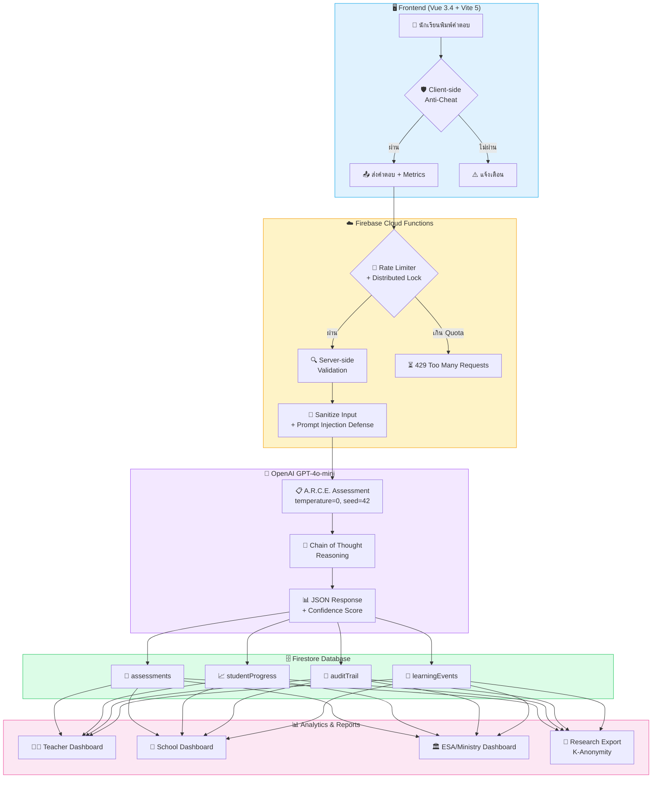
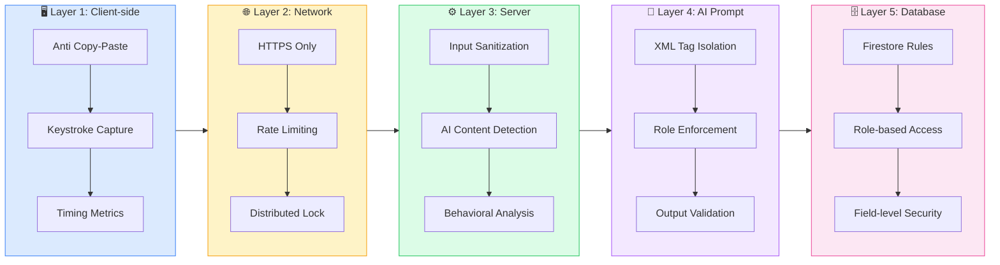
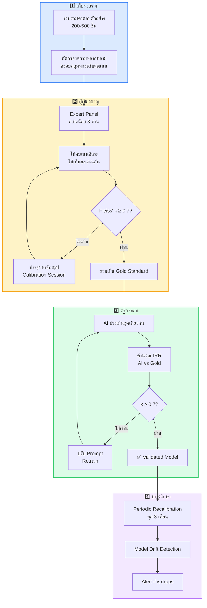

<div align="center">

# 🧠 HOTS AI ChatLoop

### *ระบบนิเวศการเรียนรู้เพื่อประเมินและพัฒนาทักษะการคิดขั้นสูงด้วยปัญญาประดิษฐ์*

---


<br/>

[🚀 **ทดลองใช้งาน**](https://hots-ai-d028b.web.app) · [📖 **เอกสารฉบับเต็ม**](DOCS_TH.md) · [🔬 **คู่มือวิจัย**](RESEARCH_DATA_PIPELINE_TH.md) · [🛡️ **ความน่าเชื่อถือ**](RELIABILITY_ECOSYSTEM_TH.md)

</div>

---

## 📜 บทสรุปสำหรับผู้บริหาร (Executive Summary)

> **"เปลี่ยนห้องเรียนไทยให้เป็นห้องทดลองทางความคิด ด้วยปัญญาประดิษฐ์ที่โปร่งใส ตรวจสอบได้ และพร้อมขยายผลระดับชาติ"**

**HOTS AI ChatLoop** คือแพลตฟอร์มการศึกษาที่ใช้ปัญญาประดิษฐ์ในการ **ประเมินและพัฒนาทักษะการคิดขั้นสูง** (Higher-Order Thinking Skills) ของนักเรียนแบบ Real-time ผ่านกรอบแนวคิด **A.R.C.E. Framework** ที่ออกแบบมาเพื่อรองรับการใช้งานตั้งแต่ระดับห้องเรียนจนถึงระดับกระทรวงศึกษาธิการ

### 🎯 จุดเปลี่ยนสำคัญ (Key Differentiators)

| ความท้าทายเดิม | นวัตกรรมที่นำเสนอ |
|:-------------:|:----------------:|
| ครู 1 คนตรวจงาน 40 คน ไม่ทั่วถึง | AI ประเมินทันที พร้อม Feedback รายบุคคล |
| การให้คะแนนขึ้นอยู่กับอารมณ์ผู้ตรวจ | **Deterministic Scoring** — ผลลัพธ์คงที่ ตรวจสอบย้อนกลับได้ |
| ไม่รู้ว่าเด็กอ่อนตรงไหน | ระบบวิเคราะห์จุดอ่อนรายมิติ + LO Tracking |
| ข้อมูลกระจัดกระจาย ใช้วิจัยไม่ได้ | **Research Pipeline** — Export ข้อมูลพร้อมวิเคราะห์ทันที |
| ขยายผลยาก ติดตั้งซับซ้อน | **Zero-Install** — เข้าใช้งานผ่านเว็บได้ทันที |

---

## 🏗️ สถาปัตยกรรมระบบ (System Architecture)

### 📊 Data Flow Diagram



### 🔧 Tech Stack Overview

| Layer | Technology | หน้าที่หลัก |
|:-----:|:----------:|:-----------|
| **Frontend** | Vue 3.4 + Vite 5 | SPA, PWA Ready, 122+ Components |
| **State** | Pinia (8 Stores) | Global State, Persistence |
| **Styling** | TailwindCSS + DaisyUI | Responsive, Dark Mode |
| **Backend** | Cloud Functions (Node.js 20) | 99 Functions, 40,000+ Lines |
| **Database** | Firestore | 25+ Collections, Real-time Sync |
| **AI Engine** | GPT-4o-mini | Deterministic Assessment |
| **Auth** | Firebase Auth + Google SSO | Role-based Access Control |
| **Hosting** | Firebase Hosting | CDN, SSL, Auto-scaling |
| **Monitoring** | Cloud Logging | Audit Trail, Error Tracking |

---

## 🎯 กรอบแนวคิด A.R.C.E. (Core Philosophy)

### 📐 โครงสร้างการประเมิน 4 มิติ

```
┌────────────────────────────────────────────────────────────────────────────────┐
│                           🎯 A.R.C.E. FRAMEWORK                                │
│                    การประเมินทักษะการคิดขั้นสูงแบบองค์รวม                        │
├────────────────────────────────────────────────────────────────────────────────┤
│                                                                                │
│   ┌──────────────────────┐          ┌──────────────────────┐                  │
│   │   📊 A — Analysis    │          │   💡 R — Reasoning   │                  │
│   │      การวิเคราะห์      │          │      การให้เหตุผล     │                  │
│   ├──────────────────────┤          ├──────────────────────┤                  │
│   │ • แยกแยะส่วนประกอบ     │          │ • อธิบายเหตุผลชัดเจน   │                  │
│   │ • หาความสัมพันธ์       │          │ • สรุปเชิงตรรกะ       │                  │
│   │ • เปรียบเทียบประเด็น   │          │ • อ้างหลักการที่เกี่ยวข้อง│                  │
│   │                      │          │                      │                  │
│   │    คะแนน: 0-5        │          │    คะแนน: 0-5        │                  │
│   └──────────────────────┘          └──────────────────────┘                  │
│                                                                                │
│   ┌──────────────────────┐          ┌──────────────────────┐                  │
│   │  🎨 C — Creativity   │          │   📚 E — Evidence    │                  │
│   │   ความคิดสร้างสรรค์    │          │    การใช้หลักฐาน     │                  │
│   ├──────────────────────┤          ├──────────────────────┤                  │
│   │ • เสนอมุมมองใหม่       │          │ • อ้างอิงข้อมูลที่เชื่อถือ │                  │
│   │ • คิดนอกกรอบ          │          │ • ยกตัวอย่างประกอบ    │                  │
│   │ • สร้างทางเลือกใหม่    │          │ • สนับสนุนข้อโต้แย้ง   │                  │
│   │                      │          │                      │                  │
│   │    คะแนน: 0-5        │          │    คะแนน: 0-5        │                  │
│   └──────────────────────┘          └──────────────────────┘                  │
│                                                                                │
│                        ═══════════════════════════                             │
│                           📊 คะแนนรวม: 0-20                                    │
│                        ═══════════════════════════                             │
│                                                                                │
└────────────────────────────────────────────────────────────────────────────────┘
```

### 🔬 ทำไมต้อง "Deterministic AI"?

การใช้ AI ในการประเมินผลการศึกษาต้องตอบโจทย์สำคัญ 3 ข้อ:

| ข้อกำหนด | ปัญหาของ AI ทั่วไป | วิธีการแก้ไขของเรา |
|:--------:|:-----------------:|:----------------:|
| **Reproducibility** | คำตอบเดิม ได้คะแนนต่างกันแต่ละครั้ง | `temperature: 0` + `seed: 42` |
| **Auditability** | ไม่รู้ว่า AI คิดอย่างไร | **Chain of Thought** + Full Audit Trail |
| **Consistency** | Model Update ทำให้ผลเปลี่ยน | **Model Fingerprint Tracking** + Drift Detection |

```javascript
// ⚙️ การตั้งค่า AI สำหรับความแม่นยำสูงสุด
const assessmentConfig = {
  model: 'gpt-4o-mini',
  temperature: 0,           // ❄️ ไม่มีความสุ่ม
  seed: 42,                 // 🎲 Seed คงที่ (The Answer to Everything)
  max_tokens: 1500,
  response_format: { type: 'json_object' }
};

// 📋 Audit Trail บันทึกทุกการประเมิน
const auditTrail = {
  modelUsed: completion.model,
  systemFingerprint: completion.system_fingerprint,  // 🔍 ติดตาม Model Version
  completionId: completion.id,
  temperature: 0,
  seed: 42,
  promptVersion: 'v3.0-cot-confidence',
  timestamp: new Date().toISOString()
};
```

### 📚 รากฐานทางทฤษฎี

| ทฤษฎี | ผู้คิดค้น | การนำไปใช้ในระบบ |
|:-----:|:--------:|:----------------|
| **Bloom's Taxonomy (Revised)** | Anderson & Krathwohl, 2001 | โครงสร้าง 4 มิติ A.R.C.E. ครอบคลุม Analyze, Evaluate, Create |
| **Zone of Proximal Development** | Vygotsky, 1978 | ระบบ Scaffolding 5 ระดับ ปรับตามคะแนนและมิติที่อ่อน |
| **Formative Assessment** | Black & Wiliam, 1998 | Feedback ทันทีพร้อมคำแนะนำปรับปรุงเฉพาะบุคคล |
| **Constructive Alignment** | Biggs & Tang, 2011 | LO Tracking เชื่อมโยงคำถาม-การประเมิน-ผลลัพธ์ |
| **Critical Thinking Framework** | Facione, 1990 | แยกแยะทักษะย่อยใน 4 มิติอย่างชัดเจน |

---

## 🛡️ ความปลอดภัยและความเป็นส่วนตัว (Security & Privacy)

### 🔐 สถาปัตยกรรมความปลอดภัย 5 ชั้น



### 📋 รายละเอียดการป้องกัน

| ชั้น | ภัยคุกคาม | มาตรการป้องกัน | การตรวจจับ |
|:----:|:--------:|:--------------:|:----------:|
| **1** | Copy-Paste | `@paste.prevent` + Server Validation | Keystroke Dynamics Analysis |
| **2** | API Abuse | Rate Limit (10 req/min) + Distributed Lock | 429 Response + Logging |
| **3** | AI-Generated Answer | `quickAICheck()` + Behavioral Signals | Risk Score 0-100 |
| **4** | Prompt Injection | XML Isolation + Strict Schema | JSON Parse Validation |
| **5** | Unauthorized Access | Firestore Rules + Role Check | Auth State Verification |

### 🇹🇭 การปฏิบัติตาม พ.ร.บ. คุ้มครองข้อมูลส่วนบุคคล (PDPA)

| หลักการ | การดำเนินการ |
|:-------:|:------------|
| **การแจ้งให้ทราบ** | แสดง Consent Modal ก่อนใช้งานครั้งแรก |
| **ความยินยอม** | บันทึก Consent Log พร้อม Timestamp |
| **การเข้าถึง** | นักเรียนดูข้อมูลตนเองได้ผ่าน Profile |
| **การลบ** | ลบข้อมูลได้ตามคำขอ (Data Retention Policy) |
| **ความปลอดภัย** | ไม่ส่ง PII ไปยัง AI — ใช้เฉพาะ Student ID |
| **K-Anonymity** | Export วิจัย มี k=5, 10, 20 option |

---

## 🚀 คู่มือการติดตั้ง (Implementation Guide)

### 📋 สิ่งที่ต้องเตรียม (Prerequisites)

```bash
# ตรวจสอบเวอร์ชัน
node --version    # ต้องการ v18.0.0 ขึ้นไป
npm --version     # ต้องการ v9.0.0 ขึ้นไป
firebase --version # ต้องการ v13.0.0 ขึ้นไป
```

### ⚡ Quick Start (5 นาที)

```bash
# 1️⃣ Clone Repository
git clone https://github.com/saengpech-sys/hots-ai.git
cd hots-ai

# 2️⃣ Install Dependencies
npm install
cd functions && npm install && cd ..

# 3️⃣ Configure Environment
cp .env.example .env
cp functions/.env.example functions/.env
# แก้ไขไฟล์ .env ตามคำแนะนำด้านล่าง

# 4️⃣ Firebase Setup
firebase login
firebase use --add  # เลือก Project ที่สร้างไว้

# 5️⃣ Run Development Server
npm run dev                         # Frontend (port 5173)
cd functions && npm run serve       # Cloud Functions Emulator
```

### 🔐 Environment Variables

**Frontend (`.env`):**
```env
# Firebase Configuration
VITE_FIREBASE_API_KEY=AIza...your-api-key
VITE_FIREBASE_AUTH_DOMAIN=your-project.firebaseapp.com
VITE_FIREBASE_PROJECT_ID=your-project-id
VITE_FIREBASE_STORAGE_BUCKET=your-project.appspot.com
VITE_FIREBASE_MESSAGING_SENDER_ID=123456789012
VITE_FIREBASE_APP_ID=1:123456789012:web:abcdef123456

# Cloud Functions URL
VITE_FUNCTIONS_URL=https://us-central1-your-project.cloudfunctions.net
```

**Backend (`functions/.env`):**
```env
# OpenAI Configuration (Required)
OPENAI_API_KEY=sk-your-openai-api-key
OPENAI_MODEL=gpt-4o-mini

# Optional: Redis for Distributed Rate Limiting
REDIS_HOST=your-redis-host
REDIS_PORT=6379
```

### 🚢 Production Deployment

```bash
# Build Frontend
npm run build

# Deploy Everything
firebase deploy

# หรือ Deploy เฉพาะส่วน
firebase deploy --only hosting      # Frontend only
firebase deploy --only functions    # Cloud Functions only
firebase deploy --only firestore    # Security Rules only
```

---

## 🔬 ความสามารถด้านงานวิจัย (Research Capabilities)

### 📊 Inter-Rater Reliability (IRR)

ระบบรองรับการคำนวณความเที่ยงตรงระหว่างผู้ประเมินหลายวิธี:

| วิธีการ | สูตร | การใช้งาน |
|:------:|:----:|:---------|
| **Cohen's Kappa** | κ = (Po - Pe) / (1 - Pe) | AI vs Expert (2 Raters) |
| **Weighted Kappa** | Linear/Quadratic weights | Ordinal Scale (0-5) |
| **Fleiss' Kappa** | Multi-rater extension | Multiple Human Raters |
| **ICC (2,1)** | Two-way Random | Continuous Scores |
| **Krippendorff's Alpha** | General purpose | Missing Data Support |

```javascript
// ตัวอย่างการคำนวณ IRR
const irrResult = await calculateIRR({
  courseId: 'CS101',
  raterType: 'AI_vs_Expert',
  sampleSize: 100,
  dimensions: ['analysis', 'reasoning', 'creativity', 'evidence']
});

// ผลลัพธ์
{
  cohensKappa: 0.78,           // Substantial Agreement
  weightedKappa: 0.82,         // Almost Perfect
  interpretation: "Good",
  confidenceInterval: [0.71, 0.85],
  sampleSize: 100
}
```

### 🏆 Golden Dataset Workflow



### 📤 Research Data Export

| Format | Endpoint | คุณสมบัติ |
|:------:|:--------:|:---------|
| **CSV** | `?format=csv` | Flat Schema, SPSS/Stata Ready, UTF-8 BOM |
| **JSON** | `?format=json` | Summary Statistics |
| **Hierarchical** | `?format=hierarchical` | Nested Structure (Student → Assessments → Details) |
| **K-Anonymous** | `?kAnonymity=5` | De-identified, IRB Compliant |

```bash
# ตัวอย่างการ Export
curl "https://your-project.cloudfunctions.net/exportResearchData\
?courseId=CS101\
&format=hierarchical\
&kAnonymity=10\
&dateFrom=2025-01-01\
&dateTo=2025-12-31"
```

---

## 📊 สถิติโปรเจกต์ (Project Statistics)

| หมวด | จำนวน | รายละเอียด |
|:----:|:-----:|:-----------|
| **Vue Components** | 80+ | รวม 45+ หน้าหลัก (Views) |
| **Cloud Functions** | 41 | HTTP + Scheduled + Triggers |
| **โค้ด Backend** | 10,400+ บรรทัด | Modular Architecture |
| **Firestore Collections** | 25+ | Normalized Schema |
| **Unit Tests** | 123 | 48 Backend + 75 Frontend |
| **API Endpoints** | 35+ | RESTful + Real-time |
| **Supported Roles** | 5 | Student, Teacher, School Admin, ESA, Ministry |

---

## 🧪 การทดสอบ (Testing)

### 📋 คำสั่งทดสอบ

```bash
# Frontend Tests (Vitest)
npm test                  # รัน 75 tests
npm run test:ui           # Interactive UI
npm run test:coverage     # Coverage Report

# Backend Tests (Jest)
cd functions
npm test                  # รัน 48 tests
npm run test:watch        # Watch Mode
```

### ✅ Test Coverage Summary

| Module | Tests | Coverage |
|:------:|:-----:|:--------:|
| `auth.test.js` | 17 | 95% |
| `gamification.test.js` | 26 | 92% |
| `prompts.test.js` | 10 | 88% |
| `aiParser.test.js` | 18 | 94% |
| `loAssessment.test.js` | 10 | 91% |
| `rateLimiter.test.js` | 10 | 89% |
| **Total** | **123** | **~91%** |

---

## 🏆 รางวัลและการรับรอง (Awards & Certifications)

### 🎖️ DPA Awards Assessment (11/11 คะแนน)

| มิติ | เกณฑ์ | ผลการประเมิน |
|:----:|:----:|:------------:|
| **1. นวัตกรรมการสอน** | 3 | ✅ 3/3 |
| **2. ความเป็นเลิศทางเทคนิค** | 3 | ✅ 3/3 |
| **3. การวัดและประเมินผล** | 3 | ✅ 3/3 |
| **4. ความยั่งยืนและขยายผล** | 2 | ✅ 2/2 |
| **รวม** | **11** | ✅ **11/11 (100%)** |

### 📜 การรับรองมาตรฐาน

- ✅ สอดคล้องหลักสูตรแกนกลาง สพฐ. 2560
- ✅ ปฏิบัติตาม พ.ร.บ. คุ้มครองข้อมูลส่วนบุคคล 2562 (PDPA)
- ✅ รองรับ Web Content Accessibility Guidelines (WCAG) 2.1 AA
- ✅ Open Source License (MIT)

---

## 📚 เอกสารเพิ่มเติม (Additional Documentation)

| เอกสาร | คำอธิบาย |
|:------:|:---------|
| [📖 DOCS_TH.md](DOCS_TH.md) | คู่มือการใช้งานฉบับเต็ม (ภาษาไทย) |
| [🔬 RESEARCH_DATA_PIPELINE_TH.md](RESEARCH_DATA_PIPELINE_TH.md) | คู่มือสำหรับนักวิจัย |
| [🛡️ RELIABILITY_ECOSYSTEM_TH.md](RELIABILITY_ECOSYSTEM_TH.md) | ระบบความน่าเชื่อถือ |
| [🏆 GOLDEN_DATASET_IRR_TH.md](GOLDEN_DATASET_IRR_TH.md) | Golden Dataset & IRR |
| [📋 DPA_ASSESSMENT_CHECKLIST_TH.md](DPA_ASSESSMENT_CHECKLIST_TH.md) | Checklist DPA Awards |
| [🔍 CODE_AUDIT_REPORT_TH.md](CODE_AUDIT_REPORT_TH.md) | รายงานตรวจสอบโค้ด |

---

## 👥 ทีมพัฒนา (Development Team)

| บทบาท | ความรับผิดชอบ |
|:-----:|:-------------|
| **Lead Developer** | System Architecture, AI Integration, Security |
| **Frontend Developer** | Vue 3 Components, UX/UI Design, PWA |
| **Backend Developer** | Cloud Functions, Firestore, API Design |
| **Education Specialist** | A.R.C.E. Framework, Curriculum Alignment |
| **Research Advisor** | IRR Methodology, Data Pipeline |

---

## 🤝 การมีส่วนร่วม (Contributing)

เรายินดีรับ Pull Requests! กรุณาอ่าน [CONTRIBUTING.md](CONTRIBUTING.md) ก่อนเริ่มต้น

```bash
# Fork & Clone
git clone https://github.com/your-username/hots-ai.git

# Create Branch
git checkout -b feature/your-feature-name

# Commit with Conventional Commits
git commit -m "feat: add new feature"

# Push & Create PR
git push origin feature/your-feature-name
```

---

## 📄 สัญญาอนุญาต (License)

โปรเจกต์นี้เผยแพร่ภายใต้ [MIT License](LICENSE)

```
MIT License

Copyright (c) 2025 HOTS AI ChatLoop Team

Permission is hereby granted, free of charge, to any person obtaining a copy
of this software and associated documentation files (the "Software"), to deal
in the Software without restriction, including without limitation the rights
to use, copy, modify, merge, publish, distribute, sublicense, and/or sell
copies of the Software...
```

---

<div align="center">

### 🧠 HOTS AI ChatLoop

**เสริมพลังนักเรียนไทย ด้วยการประเมินทักษะการคิดขั้นสูงจากปัญญาประดิษฐ์**

---

**Version 6.1.0** · **2 มกราคม 2569**

[🌐 Website](https://hots-ai-d028b.web.app) · [📖 Docs](DOCS_TH.md) · [🐛 Issues](https://github.com/saengpech-sys/hots-ai/issues) · [💬 Discussions](https://github.com/saengpech-sys/hots-ai/discussions)

---

<sub>Made with ❤️ for Thai Education</sub>

</div>
