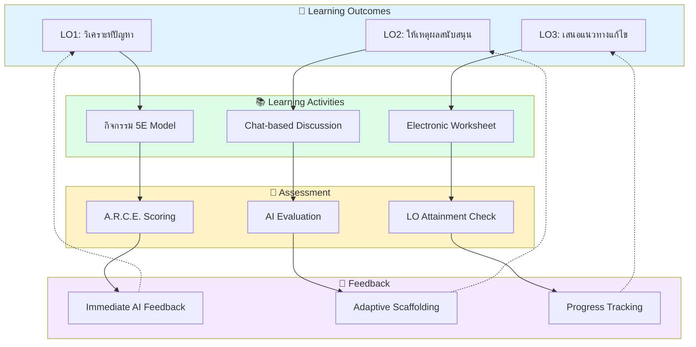

<div align="center">

# 🧠 HOTS AI ChatLoop

## บทที่ 2: กรอบแนวคิดทางทฤษฎี
### Theoretical Framework

---


**Academic Documentation Suite — บทที่ 2**  
**ปรับปรุงล่าสุด:** ธันวาคม 2568

</div>

---

## สารบัญ (Table of Contents)

1. [บทนำ: รากฐานทางทฤษฎี](#1-บทนำ-รากฐานทางทฤษฎี)
2. [A.R.C.E. Framework Deep Dive](#2-arce-framework-deep-dive)
3. [การเทียบเคียงกับ Bloom's Taxonomy](#3-การเทียบเคียงกับ-blooms-taxonomy)
4. [AI Pedagogy: Vygotsky's ZPD และ Adaptive Scaffolding](#4-ai-pedagogy-vygotskys-zpd-และ-adaptive-scaffolding)
5. [Constructive Alignment Model](#5-constructive-alignment-model)
6. [Assessment Rubric: เกณฑ์การให้คะแนน A.R.C.E.](#6-assessment-rubric-เกณฑ์การให้คะแนน-arce)
7. [Gamification Theory: Self-Determination Theory](#7-gamification-theory-self-determination-theory)

---

## 1. บทนำ: รากฐานทางทฤษฎี

### 1.1 ทฤษฎีพื้นฐาน 6 ประการ

HOTS AI ChatLoop สังเคราะห์จากทฤษฎีการศึกษาที่ได้รับการยอมรับในระดับสากล:

```
┌─────────────────────────────────────────────────────────────────────────────┐
│                    THEORETICAL FOUNDATION (6 Pillars)                       │
├─────────────────────────────────────────────────────────────────────────────┤
│                                                                             │
│  ┌─────────────┐  ┌─────────────┐  ┌─────────────┐                         │
│  │   BLOOM'S   │  │  VYGOTSKY   │  │  BLACK &    │                         │
│  │   REVISED   │  │    ZPD      │  │   WILIAM    │                         │
│  │  TAXONOMY   │  │             │  │             │                         │
│  │  (2001)     │  │  (1978)     │  │  (1998)     │                         │
│  └──────┬──────┘  └──────┬──────┘  └──────┬──────┘                         │
│         │                │                │                                 │
│         │    ┌───────────┴────────────────┘                                │
│         │    │                                                              │
│         ▼    ▼                                                              │
│  ┌─────────────────────────────────────────────────────────────────────┐   │
│  │                                                                      │   │
│  │                    🎯 A.R.C.E. FRAMEWORK                             │   │
│  │                                                                      │   │
│  │     Analysis  •  Reasoning  •  Creativity  •  Evidence              │   │
│  │                                                                      │   │
│  └─────────────────────────────────────────────────────────────────────┘   │
│         ▲    ▲                                                              │
│         │    │                                                              │
│         │    └───────────┬────────────────┐                                │
│         │                │                │                                 │
│  ┌──────┴──────┐  ┌──────┴──────┐  ┌──────┴──────┐                         │
│  │   DECI &    │  │   BIGGS     │  │   BLOOM'S   │                         │
│  │    RYAN     │  │  CONSTRUCT  │  │   MASTERY   │                         │
│  │    SDT      │  │  ALIGNMENT  │  │   LEARNING  │                         │
│  │  (1985)     │  │  (1996)     │  │  (1968)     │                         │
│  └─────────────┘  └─────────────┘  └─────────────┘                         │
│                                                                             │
└─────────────────────────────────────────────────────────────────────────────┘
```

| ทฤษฎี | ผู้เสนอ | การประยุกต์ใช้ในระบบ |
|:------|:--------|:--------------------|
| **Bloom's Revised Taxonomy** | Anderson & Krathwohl (2001) | กรอบ A.R.C.E. วัดทักษะระดับ Analyze, Evaluate, Create |
| **Zone of Proximal Development** | Vygotsky (1978) | Adaptive Scaffolding 5 ระดับ |
| **Formative Assessment** | Black & Wiliam (1998) | Immediate Feedback Loop |
| **Self-Determination Theory** | Deci & Ryan (1985) | Gamification (Autonomy, Competence, Relatedness) |
| **Constructive Alignment** | Biggs (1996) | LO → Activity → Assessment → Feedback |
| **Mastery Learning** | Bloom (1968) | LO-based Progression System |

---

## 2. A.R.C.E. Framework Deep Dive

### 2.1 ภาพรวม A.R.C.E.

**A.R.C.E.** เป็นกรอบการประเมินทักษะการคิดขั้นสูงที่พัฒนาขึ้นเพื่อให้ AI สามารถประเมินคำตอบอัตนัยได้อย่างเป็นระบบ:

```
┌─────────────────────────────────────────────────────────────────────────────┐
│                         A.R.C.E. FRAMEWORK                                  │
│                "กรอบประเมินทักษะการคิดขั้นสูง 4 มิติ"                          │
├─────────────────────────────────────────────────────────────────────────────┤
│                                                                             │
│   ┌───────────────────────────────────────────────────────────────────┐    │
│   │                                                                    │    │
│   │    📊 Analysis        💡 Reasoning       🎨 Creativity      📚 Evidence │
│   │    ─────────────      ─────────────      ─────────────      ───────────│
│   │    การวิเคราะห์         การให้เหตุผล        ความคิดสร้างสรรค์    การใช้หลักฐาน │
│   │                                                                    │    │
│   │    • แยกแยะประเด็น      • อธิบายเหตุผล      • เสนอมุมมองใหม่     • อ้างอิงข้อมูล │
│   │    • หาความสัมพันธ์     • ใช้ตรรกะ          • คิดนอกกรอบ        • ยกตัวอย่าง   │
│   │    • เปรียบเทียบ        • อ้างหลักการ       • สังเคราะห์         • หลักฐานเชิงประจักษ์│
│   │                                                                    │    │
│   └───────────────────────────────────────────────────────────────────┘    │
│                                                                             │
│                    คะแนนแต่ละมิติ: 0-5 | รวม: 0-20                          │
│                                                                             │
└─────────────────────────────────────────────────────────────────────────────┘
```

### 2.2 Analysis (การวิเคราะห์)

> **นิยาม:** ความสามารถในการแยกแยะข้อมูล ระบุส่วนประกอบ หาความสัมพันธ์ และเปรียบเทียบ

**Cognitive Processes:**
| กระบวนการ | คำอธิบาย | ตัวอย่างพฤติกรรม |
|:----------|:---------|:----------------|
| **Differentiating** | แยกแยะส่วนที่เกี่ยวข้อง/ไม่เกี่ยวข้อง | "ปัจจัยหลักที่ส่งผลคือ... ส่วนปัจจัยรองได้แก่..." |
| **Organizing** | จัดโครงสร้างข้อมูล | "สามารถจำแนกได้เป็น 3 กลุ่ม คือ..." |
| **Attributing** | ระบุมุมมอง/ความลำเอียง | "ผู้เขียนมีจุดยืนว่า... เนื่องจาก..." |

**Guiding Questions สำหรับ AI:**
```
- นักเรียนแยกแยะประเด็นหลัก/รองได้หรือไม่?
- มีการระบุความสัมพันธ์ระหว่างแนวคิดหรือไม่?
- มีการเปรียบเทียบ/ความแตกต่างหรือไม่?
- มีการจัดลำดับความสำคัญหรือไม่?
```

### 2.3 Reasoning (การให้เหตุผล)

> **นิยาม:** ความสามารถในการอธิบายเหตุผล ใช้ตรรกะอย่างสมเหตุสมผล และอ้างอิงหลักการ/ทฤษฎี

**Cognitive Processes:**
| กระบวนการ | คำอธิบาย | ตัวอย่างพฤติกรรม |
|:----------|:---------|:----------------|
| **Explaining** | อธิบายว่าทำไม/อย่างไร | "เหตุที่เป็นเช่นนั้นเพราะ..." |
| **Inferring** | อนุมานจากหลักฐาน | "จากข้อมูลนี้ สรุปได้ว่า..." |
| **Justifying** | ให้เหตุผลสนับสนุน | "ตามหลักการของ... จึงสรุปได้ว่า..." |

**Guiding Questions สำหรับ AI:**
```
- มีการอธิบาย "ทำไม" หรือ "อย่างไร" หรือไม่?
- ตรรกะสมเหตุสมผลหรือไม่?
- มีการอ้างอิงหลักการ/ทฤษฎีหรือไม่?
- มีการพิจารณาข้อโต้แย้ง/มุมมองอื่นหรือไม่?
```

### 2.4 Creativity (ความคิดสร้างสรรค์)

> **นิยาม:** ความสามารถในการเสนอมุมมองใหม่ คิดนอกกรอบ และสังเคราะห์แนวคิดที่แปลกใหม่

**Cognitive Processes:**
| กระบวนการ | คำอธิบาย | ตัวอย่างพฤติกรรม |
|:----------|:---------|:----------------|
| **Generating** | สร้างทางเลือก/สมมติฐาน | "อีกทางเลือกหนึ่งที่เป็นไปได้คือ..." |
| **Planning** | วางแผนวิธีการใหม่ | "หากต้องแก้ไขปัญหานี้ ผมจะ..." |
| **Producing** | สร้างผลงานใหม่ | "ผมเสนอโมเดลใหม่ที่..." |

**Guiding Questions สำหรับ AI:**
```
- มีการเสนอมุมมอง/แนวคิดใหม่หรือไม่?
- มีการคิดนอกกรอบจากคำตอบทั่วไปหรือไม่?
- มีการสังเคราะห์ความรู้จากหลายแหล่งหรือไม่?
- มีการเสนอทางเลือก/แนวทางที่หลากหลายหรือไม่?
```

### 2.5 Evidence (การใช้หลักฐาน)

> **นิยาม:** ความสามารถในการอ้างอิงข้อมูล ยกตัวอย่าง และสนับสนุนด้วยหลักฐานเชิงประจักษ์

**Cognitive Processes:**
| กระบวนการ | คำอธิบาย | ตัวอย่างพฤติกรรม |
|:----------|:---------|:----------------|
| **Citing** | อ้างอิงแหล่งข้อมูล | "ตามรายงานของ WHO (2024)..." |
| **Exemplifying** | ยกตัวอย่างประกอบ | "ตัวอย่างเช่น กรณีของประเทศ..." |
| **Supporting** | ใช้ข้อมูลสนับสนุน | "ข้อมูลสถิติแสดงว่า 75% ของ..." |

**Guiding Questions สำหรับ AI:**
```
- มีการอ้างอิงข้อมูล/แหล่งที่มาหรือไม่?
- มีตัวอย่างประกอบหรือไม่?
- หลักฐานที่ใช้เฉพาะเจาะจงหรือกว้างเกินไป?
- ข้อมูลที่อ้างอิงถูกต้อง/น่าเชื่อถือหรือไม่?
```

---

## 3. การเทียบเคียงกับ Bloom's Taxonomy

### 3.1 Bloom's Revised Taxonomy (Anderson & Krathwohl, 2001)

```
┌─────────────────────────────────────────────────────────────────────────────┐
│                    BLOOM'S REVISED TAXONOMY                                  │
├─────────────────────────────────────────────────────────────────────────────┤
│                                                                             │
│                           ┌─────────┐                                       │
│                          /  CREATE   \     ← HOTS                          │
│                         /─────────────\       │                             │
│                        /   EVALUATE    \      │                             │
│                       /─────────────────\     │                             │
│                      /     ANALYZE       \    ↓                             │
│                     /─────────────────────\                                 │
│                    /       APPLY           \  ← LOTS                        │
│                   /─────────────────────────\    │                          │
│                  /       UNDERSTAND          \   │                          │
│                 /─────────────────────────────\  │                          │
│                /         REMEMBER              \ ↓                          │
│               ─────────────────────────────────                             │
│                                                                             │
│   HOTS = Higher-Order Thinking Skills (Analyze, Evaluate, Create)          │
│   LOTS = Lower-Order Thinking Skills (Remember, Understand, Apply)         │
│                                                                             │
└─────────────────────────────────────────────────────────────────────────────┘
```

### 3.2 A.R.C.E. → Bloom's Mapping

| A.R.C.E. Dimension | Primary Bloom's Level | Secondary Bloom's Level | Cognitive Verbs |
|:-------------------|:----------------------|:------------------------|:----------------|
| **📊 Analysis** | **Analyze** | Evaluate | แยกแยะ, เปรียบเทียบ, จำแนก, วิเคราะห์ |
| **💡 Reasoning** | **Evaluate** | Analyze | ประเมิน, ตัดสิน, ให้เหตุผล, วิพากษ์ |
| **🎨 Creativity** | **Create** | Evaluate | สร้าง, ออกแบบ, สังเคราะห์, เสนอ |
| **📚 Evidence** | **Analyze** | Apply | อ้างอิง, สนับสนุน, ยืนยัน, พิสูจน์ |

### 3.3 A.R.C.E. → Critical Thinking Skills Mapping

| A.R.C.E. | Paul & Elder's CT Elements | Facione's CT Skills | Watson-Glaser CT |
|:---------|:---------------------------|:--------------------|:-----------------|
| **Analysis** | Information, Concepts | Interpretation, Analysis | Recognition of Assumptions |
| **Reasoning** | Inference, Implications | Inference, Explanation | Interpretation, Deduction |
| **Creativity** | Point of View, Purpose | - | - |
| **Evidence** | Information, Evidence | Evaluation | Evaluation of Arguments |

### 3.4 Comprehensive Comparison Matrix

```
┌─────────────────────────────────────────────────────────────────────────────┐
│                    A.R.C.E. vs OTHER FRAMEWORKS                              │
├─────────────────────────────────────────────────────────────────────────────┤
│                                                                             │
│   Framework        │ Analysis │ Reasoning │ Creativity │ Evidence │        │
│   ─────────────────┼──────────┼───────────┼────────────┼──────────┤        │
│   Bloom's Revised  │ Analyze  │ Evaluate  │  Create    │ Analyze  │        │
│   Webb's DOK       │ Level 3  │ Level 4   │  Level 4   │ Level 3  │        │
│   SOLO Taxonomy    │ Relation │ Extended  │  Extended  │ Multi-   │        │
│                    │          │ Abstract  │  Abstract  │ Struct   │        │
│   Marzano's        │ Analysis │ Knowledge │ Knowledge  │ Analysis │        │
│                    │          │ Util.     │  Util.     │          │        │
│   Costa's Levels   │ Level 3  │ Level 3   │  Level 3   │ Level 2  │        │
│                                                                             │
│   Legend: All A.R.C.E. dimensions target Higher-Order Thinking             │
│                                                                             │
└─────────────────────────────────────────────────────────────────────────────┘
```

---

## 4. AI Pedagogy: Vygotsky's ZPD และ Adaptive Scaffolding

### 4.1 Zone of Proximal Development (Vygotsky, 1978)

> *"สิ่งที่เด็กสามารถทำได้วันนี้ด้วยความช่วยเหลือ พรุ่งนี้เขาจะทำได้ด้วยตนเอง"*
> — Lev Vygotsky

```
┌─────────────────────────────────────────────────────────────────────────────┐
│                    ZONE OF PROXIMAL DEVELOPMENT (ZPD)                        │
├─────────────────────────────────────────────────────────────────────────────┤
│                                                                             │
│   ┌─────────────────────────────────────────────────────────────────────┐  │
│   │                                                                      │  │
│   │   ┌───────────────────────────────────────────────────────────┐     │  │
│   │   │                                                            │     │  │
│   │   │   ┌─────────────────────────────────────────────────┐     │     │  │
│   │   │   │                                                  │     │     │  │
│   │   │   │        ZONE OF CURRENT DEVELOPMENT              │     │     │  │
│   │   │   │        (ทำได้ด้วยตนเอง)                          │     │     │  │
│   │   │   │                                                  │     │     │  │
│   │   │   └─────────────────────────────────────────────────┘     │     │  │
│   │   │                                                            │     │  │
│   │   │              ZONE OF PROXIMAL DEVELOPMENT                 │     │  │
│   │   │              (ทำได้ด้วยความช่วยเหลือ)                       │     │  │
│   │   │                                                            │     │  │
│   │   │              🤖 AI Scaffolding ทำหน้าที่ตรงนี้              │     │  │
│   │   │                                                            │     │  │
│   │   └───────────────────────────────────────────────────────────┘     │  │
│   │                                                                      │  │
│   │                    BEYOND CURRENT REACH                              │  │
│   │                    (ยังทำไม่ได้แม้มีความช่วยเหลือ)                     │  │
│   │                                                                      │  │
│   └─────────────────────────────────────────────────────────────────────┘  │
│                                                                             │
└─────────────────────────────────────────────────────────────────────────────┘
```

### 4.2 Adaptive Scaffolding 5 Levels

ระบบ HOTS AI ChatLoop ปรับระดับ Scaffolding ตามผลการประเมิน:

| Level | ชื่อ | เงื่อนไข (A.R.C.E. Total) | ประเภท Feedback | ตัวอย่าง |
|:-----:|:-----|:--------------------------|:----------------|:---------|
| **5** | No Scaffold | 17-20 (85-100%) | Challenge + Extension | "ยอดเยี่ยม! ลองคิดต่อว่า..." |
| **4** | Minimal Hint | 13-16 (65-80%) | Brief Hint | "ลองพิจารณามุมมองอื่นเพิ่มเติม" |
| **3** | Guided Prompt | 9-12 (45-60%) | Guiding Question | "คุณคิดว่าอะไรเป็นสาเหตุหลัก?" |
| **2** | Structured Support | 5-8 (25-40%) | Framework + Example | "ลองใช้โครงสร้าง: เพราะ...ดังนั้น..." |
| **1** | Full Scaffold | 0-4 (0-20%) | Model Answer + Explanation | "ตัวอย่างคำตอบที่ดี: ..." |

### 4.3 Scaffolding Decision Algorithm

```
┌─────────────────────────────────────────────────────────────────────────────┐
│                    ADAPTIVE SCAFFOLDING ALGORITHM                            │
├─────────────────────────────────────────────────────────────────────────────┤
│                                                                             │
│   Input: A.R.C.E. Scores (A, R, C, E) + Student History                    │
│                                                                             │
│   1. Calculate Total Score: T = A + R + C + E                              │
│                                                                             │
│   2. Identify Weakest Dimension:                                           │
│      weak_dim = argmin(A, R, C, E)                                         │
│                                                                             │
│   3. Determine Scaffolding Level:                                          │
│      ┌────────────────────────────────────────────────────────────────┐    │
│      │  if T >= 17:  level = 5 (No Scaffold)                          │    │
│      │  elif T >= 13: level = 4 (Minimal Hint)                        │    │
│      │  elif T >= 9:  level = 3 (Guided Prompt)                       │    │
│      │  elif T >= 5:  level = 2 (Structured Support)                  │    │
│      │  else:         level = 1 (Full Scaffold)                       │    │
│      └────────────────────────────────────────────────────────────────┘    │
│                                                                             │
│   4. Generate Feedback:                                                     │
│      - General feedback based on level                                     │
│      - Specific feedback targeting weak_dim                                │
│      - Encouragement based on improvement from history                     │
│                                                                             │
│   Output: Personalized Feedback with appropriate scaffolding               │
│                                                                             │
└─────────────────────────────────────────────────────────────────────────────┘
```

### 4.4 Scaffolding Feedback Templates

| Level | Template Structure |
|:-----:|:-------------------|
| **5** | `✅ [ชมเชย] + 🚀 [Challenge Question] + 📚 [Extension Resource]` |
| **4** | `✅ [สิ่งที่ดี] + 💡 [Minimal Hint for weak_dim] + 🎯 [Encouragement]` |
| **3** | `✅ [สิ่งที่ดี] + ❓ [Guiding Question for weak_dim] + 📝 [Reflection Prompt]` |
| **2** | `📝 [Framework] + 💡 [Example for weak_dim] + 🎯 [Step-by-step Guide]` |
| **1** | `📖 [Model Answer] + 🔍 [Explanation] + 📝 [Practice Prompt]` |

---

## 5. Constructive Alignment Model

### 5.1 Biggs' Constructive Alignment (1996)

> *"หลักสูตรที่ออกแบบดีจะมีความสอดคล้องกันระหว่างผลลัพธ์การเรียนรู้ที่คาดหวัง กิจกรรมการเรียนรู้ และการประเมิน"*
> — John Biggs

### 5.2 Alignment Diagram



### 5.3 Alignment Matrix

```
┌─────────────────────────────────────────────────────────────────────────────┐
│                    CONSTRUCTIVE ALIGNMENT MATRIX                             │
├─────────────────────────────────────────────────────────────────────────────┤
│                                                                             │
│   Learning        │ Teaching/Learning │ Assessment      │ Feedback         │
│   Outcome         │ Activity          │ Method          │ Loop             │
│   ────────────────┼───────────────────┼─────────────────┼──────────────────│
│   LO1: Analyze    │ 5E-Engage:        │ A.R.C.E.        │ Scaffolding      │
│   ปัญหา           │ Case Study        │ Analysis Score  │ Level 1-5        │
│                   │                   │                 │                  │
│   LO2: Evaluate   │ 5E-Explore:       │ A.R.C.E.        │ Guided           │
│   ข้อมูล          │ Discussion        │ Reasoning Score │ Questions        │
│                   │                   │                 │                  │
│   LO3: Create     │ 5E-Elaborate:     │ A.R.C.E.        │ Challenge        │
│   ทางออก          │ Project-based     │ Creativity Score│ Extension        │
│                   │                   │                 │                  │
│   LO4: Support    │ 5E-Explain:       │ A.R.C.E.        │ Evidence         │
│   ด้วยหลักฐาน     │ Research          │ Evidence Score  │ Examples         │
│                                                                             │
└─────────────────────────────────────────────────────────────────────────────┘
```

### 5.4 5E Model Integration

| 5E Phase | กิจกรรม | A.R.C.E. Dimension เน้น | AI Role |
|:---------|:--------|:-----------------------|:--------|
| **Engage** | ตั้งคำถามกระตุ้น | Analysis | Generate Hook Question |
| **Explore** | สำรวจ/ค้นคว้า | Evidence | Provide Resources |
| **Explain** | อธิบายแนวคิด | Reasoning | Clarify Concepts |
| **Elaborate** | ขยายความรู้ | Creativity | Challenge Extension |
| **Evaluate** | ประเมินผล | **All A.R.C.E.** | Score + Feedback |

---

## 6. Assessment Rubric: เกณฑ์การให้คะแนน A.R.C.E.

### 6.1 Rubric Overview

ระบบใช้ **Analytic Rubric** ที่ให้คะแนนแยกตาม 4 มิติ โดยแต่ละมิติมีคะแนน 0-5:

```
┌─────────────────────────────────────────────────────────────────────────────┐
│                         A.R.C.E. SCORING RUBRIC                              │
├─────────────────────────────────────────────────────────────────────────────┤
│                                                                             │
│   Score │ Level          │ Description                                     │
│   ──────┼────────────────┼─────────────────────────────────────────────────│
│    5    │ Exemplary      │ ยอดเยี่ยม — เหนือความคาดหมาย                      │
│    4    │ Proficient     │ ดีมาก — ครบถ้วนตามเกณฑ์                          │
│    3    │ Developing     │ พอใช้ — มีบางส่วนแต่ไม่ครบ                        │
│    2    │ Emerging       │ เริ่มต้น — มีเบื้องต้น                            │
│    1    │ Beginning      │ ต้องปรับปรุง — น้อยมาก                           │
│    0    │ Not Evident    │ ไม่พบ — ไม่มีหลักฐาน                             │
│                                                                             │
│   Total Score: 0-20 points                                                 │
│   Passing Threshold: ≥ 3 in relevant dimension for LO attainment           │
│                                                                             │
└─────────────────────────────────────────────────────────────────────────────┘
```

### 6.2 Analysis Rubric (การวิเคราะห์)

| Score | Level | Behavioral Anchor (คำอธิบายเชิงพฤติกรรม) |
|:-----:|:------|:----------------------------------------|
| **5** | Exemplary | แยกแยะประเด็นได้ **ครบถ้วนและลึกซึ้ง** ระบุความสัมพันธ์ที่ซับซ้อนได้ เปรียบเทียบอย่างเป็นระบบ มีการจัดลำดับความสำคัญที่สมเหตุสมผล |
| **4** | Proficient | แยกแยะประเด็น **หลักได้ครบ** ระบุความสัมพันธ์ได้ชัดเจน มีการเปรียบเทียบที่เหมาะสม |
| **3** | Developing | แยกแยะประเด็นได้ **บางส่วน** ระบุความสัมพันธ์พื้นฐานได้ อาจขาดการจัดลำดับความสำคัญ |
| **2** | Emerging | **พยายาม** แยกแยะประเด็น แต่ยังไม่ครบถ้วนหรือไม่ชัดเจน ความสัมพันธ์ที่ระบุอาจไม่ถูกต้อง |
| **1** | Beginning | แยกแยะประเด็นได้ **น้อยมาก** หรือไม่ถูกต้อง ไม่มีการระบุความสัมพันธ์ |
| **0** | Not Evident | **ไม่พบ** การวิเคราะห์ใดๆ เป็นการบรรยายหรือคัดลอกโจทย์ |

### 6.3 Reasoning Rubric (การให้เหตุผล)

| Score | Level | Behavioral Anchor (คำอธิบายเชิงพฤติกรรม) |
|:-----:|:------|:----------------------------------------|
| **5** | Exemplary | เหตุผล **สมเหตุสมผลอย่างยิ่ง** ตรรกะแน่นหนา อ้างหลักการ/ทฤษฎีที่เหมาะสม พิจารณาข้อโต้แย้งและตอบโต้ได้ |
| **4** | Proficient | เหตุผล **ชัดเจน** ตรรกะสอดคล้อง มีการอ้างหลักการสนับสนุน |
| **3** | Developing | มีเหตุผล **บ้าง** แต่อาจไม่ครบถ้วนหรือขาดความลึกซึ้ง ตรรกะพื้นฐานถูกต้อง |
| **2** | Emerging | เหตุผล **ผิวเผิน** หรืออาจมีช่องโหว่ในตรรกะ ขาดหลักการสนับสนุน |
| **1** | Beginning | เหตุผล **ไม่สมเหตุสมผล** หรือไม่เกี่ยวข้องกับประเด็น |
| **0** | Not Evident | **ไม่พบ** การให้เหตุผล เป็นการกล่าวอ้างโดยไม่มีการอธิบาย |

### 6.4 Creativity Rubric (ความคิดสร้างสรรค์)

| Score | Level | Behavioral Anchor (คำอธิบายเชิงพฤติกรรม) |
|:-----:|:------|:----------------------------------------|
| **5** | Exemplary | เสนอมุมมอง **ใหม่และโดดเด่น** ที่ไม่ใช่คำตอบทั่วไป สังเคราะห์ความรู้จากหลายแหล่ง มีทางเลือกหลากหลายที่เป็นไปได้ |
| **4** | Proficient | มีมุมมอง **ที่น่าสนใจ** คิดนอกกรอบบ้าง มีการเสนอทางเลือกที่แตกต่าง |
| **3** | Developing | มีความคิด **บางส่วน** ที่แตกต่างจากคำตอบทั่วไป แต่ยังไม่โดดเด่น |
| **2** | Emerging | คำตอบ **ค่อนข้างทั่วไป** มีความพยายามคิดต่าง แต่ยังไม่ชัดเจน |
| **1** | Beginning | คำตอบ **ซ้ำกับความรู้ทั่วไป** ไม่มีมุมมองใหม่ |
| **0** | Not Evident | **ไม่พบ** ความคิดสร้างสรรค์ เป็นการคัดลอกหรือท่องจำ |

### 6.5 Evidence Rubric (การใช้หลักฐาน)

| Score | Level | Behavioral Anchor (คำอธิบายเชิงพฤติกรรม) |
|:-----:|:------|:----------------------------------------|
| **5** | Exemplary | อ้างอิง **หลักฐานที่หลากหลายและเฉพาะเจาะจง** แหล่งข้อมูลน่าเชื่อถือ ตัวอย่างชัดเจนและเกี่ยวข้อง มีข้อมูลเชิงปริมาณสนับสนุน |
| **4** | Proficient | มีการอ้างอิง **ที่เหมาะสม** ตัวอย่างเกี่ยวข้องและถูกต้อง แหล่งข้อมูลน่าเชื่อถือ |
| **3** | Developing | มีการอ้างอิง **บ้าง** แต่อาจไม่เฉพาะเจาะจงหรือไม่ครอบคลุม ตัวอย่างอาจกว้างเกินไป |
| **2** | Emerging | การอ้างอิง **น้อยหรือไม่ชัดเจน** ตัวอย่างอาจไม่เกี่ยวข้องหรือไม่ถูกต้อง |
| **1** | Beginning | แทบ **ไม่มี** การอ้างอิงหรือตัวอย่าง หรือข้อมูลที่ให้ไม่ถูกต้อง |
| **0** | Not Evident | **ไม่พบ** การใช้หลักฐานใดๆ เป็นความเห็นส่วนตัวล้วน |

### 6.6 LO Passing Criteria

เกณฑ์การผ่าน Learning Outcome ขึ้นอยู่กับ Bloom's Level ของ LO นั้น:

| LO Bloom's Level | Primary A.R.C.E. | Passing Criteria | Rationale |
|:-----------------|:-----------------|:-----------------|:----------|
| **Analyze** | Analysis | A ≥ 3 | ต้องแสดงทักษะวิเคราะห์ |
| **Evaluate** | Reasoning | R ≥ 3 | ต้องแสดงทักษะให้เหตุผล |
| **Create** | Creativity | C ≥ 3 | ต้องแสดงทักษะสร้างสรรค์ |
| **Mixed** | Analysis + Evidence | A ≥ 3 AND E ≥ 2 | ต้องวิเคราะห์พร้อมหลักฐาน |

---

## 7. Gamification Theory: Self-Determination Theory

### 7.1 Self-Determination Theory (Deci & Ryan, 1985)

SDT ระบุว่าแรงจูงใจภายใน (Intrinsic Motivation) เกิดจากการตอบสนองความต้องการพื้นฐาน 3 ประการ:

```
┌─────────────────────────────────────────────────────────────────────────────┐
│                    SELF-DETERMINATION THEORY (SDT)                           │
├─────────────────────────────────────────────────────────────────────────────┤
│                                                                             │
│   ┌─────────────────────────────────────────────────────────────────────┐  │
│   │                     INTRINSIC MOTIVATION                            │  │
│   │                   (แรงจูงใจภายใน)                                    │  │
│   └─────────────────────────────────────────────────────────────────────┘  │
│                              ▲                                              │
│                              │                                              │
│         ┌────────────────────┼────────────────────┐                        │
│         │                    │                    │                        │
│   ┌─────┴─────┐        ┌─────┴─────┐        ┌─────┴─────┐                  │
│   │ AUTONOMY  │        │COMPETENCE │        │RELATEDNESS│                  │
│   │ (ความเป็น  │        │ (ความสามารถ)│        │(ความสัมพันธ์)│                  │
│   │  อิสระ)    │        │           │        │           │                  │
│   └───────────┘        └───────────┘        └───────────┘                  │
│        │                    │                    │                        │
│        ▼                    ▼                    ▼                        │
│   ┌───────────┐        ┌───────────┐        ┌───────────┐                  │
│   │ • เลือกวิชา │        │ • XP/Level │        │• Leaderboard│                  │
│   │ • เลือกเวลา │        │ • Badges  │        │• Team Mode │                  │
│   │ • Self-pace│        │ • Progress │        │• Social    │                  │
│   └───────────┘        └───────────┘        └───────────┘                  │
│                                                                             │
└─────────────────────────────────────────────────────────────────────────────┘
```

### 7.2 SDT Implementation ในระบบ

| SDT Need | Implementation | Feature |
|:---------|:---------------|:--------|
| **Autonomy** | เลือกวิชา/คำถาม/เวลาได้ | Course Selection, Self-paced |
| **Competence** | Feedback ทันที, LO Progress | XP, Levels, Badges, Progress Map |
| **Relatedness** | เปรียบเทียบกับเพื่อน | Leaderboard, Class Ranking |

### 7.3 Gamification Elements

| Element | Type | SDT Alignment | Implementation |
|:--------|:-----|:--------------|:---------------|
| **XP Points** | Progress | Competence | 10-50 XP per assessment |
| **Levels** | Achievement | Competence | Level up every 500 XP |
| **Badges** | Recognition | Competence + Relatedness | Skill/Streak/LO badges |
| **Leaderboard** | Social | Relatedness | Class/School ranking |
| **Streaks** | Engagement | Autonomy + Competence | Daily login bonus |
| **Progress Map** | Visualization | Competence | LO completion tree |

---

## บรรณานุกรม (References)

Anderson, L. W., & Krathwohl, D. R. (Eds.). (2001). *A taxonomy for learning, teaching, and assessing: A revision of Bloom's taxonomy of educational objectives*. Longman.

Biggs, J. (1996). Enhancing teaching through constructive alignment. *Higher Education*, 32(3), 347-364.

Black, P., & Wiliam, D. (1998). Assessment and classroom learning. *Assessment in Education: Principles, Policy & Practice*, 5(1), 7-74.

Bloom, B. S. (1968). Learning for mastery. *Evaluation Comment*, 1(2), 1-12.

Deci, E. L., & Ryan, R. M. (1985). *Intrinsic motivation and self-determination in human behavior*. Plenum Press.

Facione, P. A. (1990). *Critical thinking: A statement of expert consensus for purposes of educational assessment and instruction*. The California Academic Press.

Paul, R., & Elder, L. (2006). *Critical thinking: Tools for taking charge of your learning and your life*. Pearson Prentice Hall.

Vygotsky, L. S. (1978). *Mind in society: The development of higher psychological processes*. Harvard University Press.

Watson, G., & Glaser, E. M. (1980). *Watson-Glaser critical thinking appraisal*. Psychological Corporation.

Webb, N. L. (1997). *Criteria for alignment of expectations and assessments in mathematics and science education*. Council of Chief State School Officers.

---

<div align="center">

**เอกสารก่อนหน้า:** [01_PROJECT_OVERVIEW.md](./01_PROJECT_OVERVIEW.md)  
**เอกสารถัดไป:** [03_SYSTEM_ARCHITECTURE.md](./03_SYSTEM_ARCHITECTURE.md)

---

*HOTS AI ChatLoop — Academic Documentation Suite*  
*Version 6.1 | January 2026*

</div>
