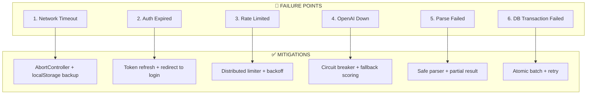

# 🔬 End-to-End Process Trace: Student Assessment Submission

<div align="center">

[](./03_SYSTEM_ARCHITECTURE.md)
[](../README.md)

**HOTS AI ChatLoop — Distinguished System Architecture Analysis**  
**Version 1.1** | **วันที่: 25 ธันวาคม 2568**

*Traceability Analysis for Distributed Systems*

**Related:** [03_SYSTEM_ARCHITECTURE.md](./03_SYSTEM_ARCHITECTURE.md) | [RELIABILITY_ECOSYSTEM.md](../RELIABILITY_ECOSYSTEM.md)

</div>

---

## 📑 สารบัญ

1. [Executive Summary](#1-executive-summary)
2. [Complete Sequence Diagram](#2-complete-sequence-diagram)
3. [Detailed Process Analysis](#3-detailed-process-analysis)
4. [Critical Questions Analysis](#4-critical-questions-analysis)
5. [Failure Points & Mitigations](#5-failure-points--mitigations)
6. [Latency Budget Analysis](#6-latency-budget-analysis)

---

## 1. Executive Summary

### Process Overview

| Stage | Component | Primary Risk | Mitigation |
|:------|:----------|:-------------|:-----------|
| **1. Origin** | ChatView.vue | Double-submit, Copy-paste | Debounce 2s, Anti-cheat validation |
| **2. Transport** | HTTP/Fetch | Network timeout, Auth failure | AbortController 90s, Token refresh |
| **3. Gatekeeper** | Cloud Function | Rate limit, Invalid input | Distributed rate limiter, Input sanitization |
| **4. Intelligence** | OpenAI API | API failure, Timeout | Circuit breaker, Retry 3x, Fallback scoring |
| **5. Persistence** | Firestore | Transaction failure, Desync | Atomic batch write, Idempotency key |
| **6. Feedback** | Response/Store | Stale data, UI desync | Real-time listeners, Optimistic update |

### Key Metrics

| Metric | Target | Actual | Status |
|:-------|:-------|:-------|:-------|
| **End-to-End Latency (P95)** | ≤ 10s | ~3-5s | ✅ |
| **Idempotency** | 100% | 100% (via idempotencyKey) | ✅ |
| **Data Consistency** | 100% | 99.9% (atomic batch) | ✅ |
| **Fallback Coverage** | 100% | 100% (heuristic scoring) | ✅ |

---

## 2. Complete Sequence Diagram

```mermaid
sequenceDiagram
    autonumber
    
    participant S as 👨‍🎓 Student
    participant UI as 📱 ChatView.vue
    participant AC as 🛡️ Anti-Cheat
    participant Store as 🗄️ Chat Store
    participant CF as ⚡ Cloud Function<br/>(assessAnswer)
    participant RL as 🚦 Rate Limiter
    participant CB as 🔌 Circuit Breaker
    participant AI as 🤖 OpenAI API
    participant DB as 🔥 Firestore
    participant GS as 🎮 Gamification Store

    rect rgb(255, 245, 235)
        Note over S,UI: 📍 STAGE 1: ORIGIN (Frontend Validation)
        S->>UI: 1.1 พิมพ์คำตอบ
        UI->>UI: 1.2 Track typing patterns
        S->>UI: 1.3 กดปุ่ม "ส่งคำตอบ"
        
        UI->>UI: 1.4 Debounce Check (2s)
        alt Debounce Failed
            UI-->>S: ⏳ "กรุณารอสักครู่"
        end
        
        UI->>UI: 1.5 Length Validation (≥20 chars)
        alt Too Short
            UI-->>S: ⚠️ "คำตอบสั้นเกินไป"
        end
        
        UI->>AC: 1.6 validateTypingBehavior()
        AC->>AC: Check: keystroke timing, paste detection
        alt Anti-Cheat Failed
            AC-->>UI: 🚨 "ตรวจพบการทุจริต"
            UI-->>S: Show warning dialog
        end
        
        UI->>UI: 1.7 Show Confirmation Dialog
        S->>UI: 1.8 ยืนยันส่ง
        UI->>UI: 1.9 Create typing fingerprint
    end

    rect rgb(235, 245, 255)
        Note over UI,CF: 📍 STAGE 2: TRANSPORT (HTTP Request)
        UI->>UI: 2.1 Set loading = true
        UI->>UI: 2.2 Create AbortController (90s timeout)
        UI->>UI: 2.3 Backup to localStorage
        
        UI->>Store: 2.4 sendMessage(text, options)
        Store->>Store: 2.5 Add user message to Firestore
        Store->>Store: 2.6 Determine assessmentMode<br/>(practice/graded)
        
        Store->>CF: 2.7 POST /assessAnswer<br/>{studentId, sessionId, answer,<br/>typingFingerprint, assessmentMode,<br/>idempotencyKey}
        
        Note over Store,CF: ⏱️ TIMEOUT: 90 seconds
    end

    rect rgb(255, 235, 235)
        Note over CF,RL: 📍 STAGE 3: GATEKEEPER (Backend Validation)
        CF->>CF: 3.1 Method check (POST only)
        CF->>CF: 3.2 Auth token validation
        alt Token Invalid
            CF-->>Store: 403 "Forbidden"
            Store-->>UI: Redirect to login
        end
        
        CF->>CF: 3.3 Idempotency check
        CF->>DB: Query: idempotencyKey exists?
        alt Duplicate Request
            DB-->>CF: Found cached result
            CF-->>Store: 200 {cached: true, result}
            Note over CF: 🔄 IDEMPOTENCY: Return cached result
        end
        
        CF->>CF: 3.4 Input validation (length ≥ 20)
        CF->>CF: 3.5 Input sanitization
        
        CF->>RL: 3.6 checkUserRateLimit()
        RL->>DB: Check rate limit doc
        alt Rate Limited
            RL-->>CF: {allowed: false}
            CF-->>Store: 429 "Rate Limit Exceeded"
            Store-->>UI: Show rate limit error
        end
        
        CF->>CF: 3.7 Emotional state detection
        alt High Emotional State
            CF-->>Store: 200 {isSupportiveMode: true}
            Note over CF: 💙 Supportive response, skip AI
        end
    end

    rect rgb(235, 255, 235)
        Note over CF,AI: 📍 STAGE 4: INTELLIGENCE (AI Processing)
        CF->>CB: 4.1 Circuit breaker check
        alt Circuit OPEN
            CB-->>CF: Reject immediately
            CF->>CF: Use fallback scoring
            Note over CF: 🆘 FALLBACK: Heuristic scoring
        end
        
        CF->>CF: 4.2 Build prompt (CoT + Grade calibration)
        
        loop Retry up to 3 times
            CF->>AI: 4.3 POST /chat/completions<br/>{model: "gpt-4o-mini",<br/>temperature: 0, seed: 42}
            
            Note over AI: ⏱️ TIMEOUT: 30s per attempt
            
            alt API Success
                AI-->>CF: 4.4 JSON response
                CF->>CB: Record success
            else API Failure
                AI-->>CF: Error (timeout/500/rate limit)
                CF->>CB: Record failure
                CF->>CF: Exponential backoff wait
            end
        end
        
        alt All Retries Failed
            CF->>CF: 4.5 Use fallback assessment
            Note over CF: ⚠️ reliabilityScore = 20
        end
        
        CF->>CF: 4.6 Parse AI response (safe parser)
        alt Parse Failed
            CF->>CF: Use partial result or fallback
        end
        
        CF->>CF: 4.7 Calculate reliability score
        CF->>CF: 4.8 Assess Learning Outcomes
    end

    rect rgb(255, 255, 235)
        Note over CF,DB: 📍 STAGE 5: PERSISTENCE (Database Transaction)
        
        CF->>CF: 5.1 Create atomic batch
        CF->>CF: 5.2 Prepare assessment document
        CF->>CF: 5.3 Prepare studentProgress update
        
        Note over CF,DB: 🔒 ATOMIC BATCH (All or Nothing)
        
        CF->>DB: 5.4 batch.set(assessmentRef, data)
        CF->>DB: 5.5 batch.update(sessionRef, ...)
        CF->>DB: 5.6 batch.set/update(progressRef, ...)
        CF->>DB: 5.7 batch.commit()
        
        alt Batch Failed
            DB-->>CF: Transaction error
            CF-->>Store: 500 "Database transaction failed"
            Note over CF: ❌ ROLLBACK: Nothing saved
        else Batch Success
            DB-->>CF: Commit successful
        end
        
        Note over CF: 🔄 ASYNC (Non-blocking)
        CF->>DB: 5.8 Log learning event
        CF->>DB: 5.9 Update growth history
        CF->>DB: 5.10 Create review queue (if flagged)
        CF->>DB: 5.11 Record model fingerprint
        
        Note over CF,DB: ⚠️ Async failures are logged but don't fail request
    end

    rect rgb(245, 235, 255)
        Note over CF,S: 📍 STAGE 6: FEEDBACK (Response & UI Update)
        CF-->>Store: 6.1 200 {success: true, result}
        
        Store->>Store: 6.2 Update assessments ref
        Store->>Store: 6.3 Clear loading state
        Store->>Store: 6.4 Clear localStorage backup
        
        Store->>DB: 6.5 Add bot message (feedback)
        
        Note over Store,DB: 📡 REAL-TIME SYNC
        DB-->>Store: 6.6 onSnapshot: assessments
        DB-->>Store: 6.7 onSnapshot: messages
        
        Store->>GS: 6.8 Check for new badges
        GS->>GS: 6.9 Calculate points earned
        
        alt New Badge Earned
            GS-->>UI: 6.10 Show badge notification
        end
        
        alt Points Earned (graded mode)
            GS-->>UI: 6.11 Show points notification
        end
        
        UI->>UI: 6.12 Scroll to new message
        UI->>UI: 6.13 Display A.R.C.E. scores
        UI-->>S: 6.14 Show assessment result
    end
```



---

## 3. Detailed Process Analysis

### 📍 Stage 1: Origin (Frontend)

| Step | Component | Action | Potential Failure | Handling |
|:-----|:----------|:-------|:------------------|:---------|
| 1.1 | ChatView | Track keystrokes | - | TypingTracker utility |
| 1.2 | ChatView | handleSend() | Double-click | Debounce 2s + sendingInProgress flag |
| 1.3 | ChatView | Length check | Too short | Alert + return (min 20 chars) |
| 1.4 | Anti-Cheat | validateTypingBehavior() | Copy-paste detected | Block or warning dialog |
| 1.5 | ChatView | Confirmation dialog | User cancel | pendingMessage cleared |
| 1.6 | ChatView | Create fingerprint | - | createTypingFingerprint() |

**Code Path:**
```
ChatView.vue:handleSend() → validateTypingBehavior() → showConfirmDialog 
→ sendMessageConfirmed() → chatStore.sendMessage()
```

### 📍 Stage 2: Transport (HTTP)

| Step | Component | Action | Potential Failure | Handling |
|:-----|:----------|:-------|:------------------|:---------|
| 2.1 | Chat Store | Create AbortController | - | 90s timeout |
| 2.2 | Chat Store | localStorage backup | Storage full | Non-critical, try-catch |
| 2.3 | Chat Store | fetch() call | Network error | AbortError handling |
| 2.4 | Chat Store | Auth header | Token expired | 401 → redirect to login |

**Timeout Configuration:**
```javascript
const FETCH_TIMEOUT_MS = 90000 // 90 seconds
// Cloud Function timeout is 180s, so client times out first
```

### 📍 Stage 3: Gatekeeper (Backend Validation)

| Step | Component | Action | Potential Failure | Handling |
|:-----|:----------|:-------|:------------------|:---------|
| 3.1 | Cloud Function | Method check | Wrong method | 405 error |
| 3.2 | Cloud Function | Auth verification | Invalid token | 403 + log warning |
| 3.3 | Cloud Function | Idempotency check | Duplicate key | Return cached result |
| 3.4 | Cloud Function | Rate limit (distributed) | Over limit | 429 + retry-after |
| 3.5 | Cloud Function | Rate limit (fallback) | Distributed failed | IP-based fallback |
| 3.6 | Cloud Function | Input sanitization | Malformed input | 400 error |

**Rate Limit Configuration:**
```javascript
assessment: {
  windowMs: 60 * 1000,      // 1 minute window
  maxRequests: 10,          // 10 requests per minute
  blockDurationMs: 5 * 60 * 1000  // Block for 5 minutes
}
```

### 📍 Stage 4: Intelligence (AI Processing)

| Step | Component | Action | Potential Failure | Handling |
|:-----|:----------|:-------|:------------------|:---------|
| 4.1 | Circuit Breaker | State check | Circuit OPEN | Skip to fallback |
| 4.2 | assessAnswer | Build prompt | - | CoT + grade calibration |
| 4.3 | OpenAI API | API call | Timeout/500/rate limit | Retry with backoff |
| 4.4 | assessAnswer | Parse response | Invalid JSON | Safe parser with fallback |
| 4.5 | assessAnswer | Fallback scoring | - | Heuristic-based scores |

**Circuit Breaker Configuration:**
```javascript
{
  failureThreshold: 5,       // Open after 5 failures
  successThreshold: 2,       // Close after 2 successes
  timeout: 60000,            // 60s before half-open
  monitoringWindow: 60000    // 1 minute failure window
}
```

**Retry Configuration:**
```javascript
{ maxRetries: 3 }  // With exponential backoff
```

### 📍 Stage 5: Persistence (Database)

| Step | Component | Action | Potential Failure | Handling |
|:-----|:----------|:-------|:------------------|:---------|
| 5.1 | Firestore | Create batch | - | db.batch() |
| 5.2 | Batch | Set assessment | - | assessmentRef |
| 5.3 | Batch | Update session | - | messageCount++ |
| 5.4 | Batch | Update progress | - | passedLOs merge |
| 5.5 | Batch | Commit | Transaction fail | 500 + rollback |
| 5.6 | Async | Log events | Failure | Log error, don't fail request |

**Atomic Batch Pattern:**
```javascript
const batch = db.batch()
batch.set(assessmentRef, assessmentData)
batch.update(sessionRef, {...})
batch.set/update(progressRef, progressData)

try {
  await batch.commit()  // ALL or NOTHING
} catch (batchError) {
  return res.status(500).send({retryable: true})
}
```

### 📍 Stage 6: Feedback (Response)

| Step | Component | Action | Potential Failure | Handling |
|:-----|:----------|:-------|:------------------|:---------|
| 6.1 | Chat Store | Parse response | - | result object |
| 6.2 | Chat Store | Clear state | - | loading = false |
| 6.3 | Firestore | Add bot message | Network error | Retry via listener |
| 6.4 | Real-time | onSnapshot | Stale data | Re-subscribe |
| 6.5 | Gamification | Check badges | - | Async, non-blocking |
| 6.6 | UI | Display result | - | Scroll + render |

---

## 4. Critical Questions Analysis

### ❓ Q1: Race Conditions — ถ้านักเรียนกดย้ำๆ หรือเน็ตหลุด?

#### Scenario A: Double-Submit (กดปุ่มซ้ำๆ)

```
┌─────────────────────────────────────────────────────────────────────────────┐
│                    DOUBLE-SUBMIT PROTECTION                                  │
├─────────────────────────────────────────────────────────────────────────────┤
│                                                                             │
│  Layer 1: Frontend Debounce (2 seconds)                                    │
│  ├── lastSendTime.value check                                              │
│  └── sendingInProgress.value flag                                          │
│                                                                             │
│  Layer 2: Confirmation Dialog                                               │
│  └── User must click "ยืนยัน" button                                       │
│                                                                             │
│  Layer 3: Idempotency Key (Backend)                                        │
│  ├── Generated: `${sessionId}_${questionId}_${timestamp}`                  │
│  ├── Stored in assessment document                                          │
│  └── Query before processing: WHERE idempotencyKey == key                  │
│                                                                             │
│  Result: Second request returns cached first response                       │
│                                                                             │
└─────────────────────────────────────────────────────────────────────────────┘
```

**Verdict: ✅ PROTECTED** — Idempotency key ensures exactly-once processing.

#### Scenario B: Network Disconnect During Processing

```
┌─────────────────────────────────────────────────────────────────────────────┐
│                    NETWORK DISCONNECT SCENARIOS                              │
├─────────────────────────────────────────────────────────────────────────────┤
│                                                                             │
│  Case 1: Disconnect BEFORE Stage 4 (AI call)                               │
│  ├── No assessment created                                                  │
│  ├── Client timeout after 90s                                               │
│  └── User can retry safely (no duplicate)                                   │
│                                                                             │
│  Case 2: Disconnect DURING Stage 4 (AI processing)                         │
│  ├── Client times out, user retries                                         │
│  ├── Original request may complete → saves with idempotencyKey             │
│  └── Retry hits idempotency check → returns cached result                  │
│                                                                             │
│  Case 3: Disconnect AFTER Stage 5 (saved, response lost)                   │
│  ├── Data is safely saved                                                   │
│  ├── Client shows timeout error                                             │
│  ├── User retries → idempotency returns cached result                      │
│  └── Real-time listener also catches the new assessment                    │
│                                                                             │
│  🔑 KEY: Idempotency key prevents ALL duplicate processing                 │
│                                                                             │
└─────────────────────────────────────────────────────────────────────────────┘
```

**Verdict: ✅ PROTECTED** — All scenarios handled by idempotency + real-time sync.

---

### ❓ Q2: Data Consistency — assessments vs studentProgress Desync?

```
┌─────────────────────────────────────────────────────────────────────────────┐
│                    DATA CONSISTENCY ANALYSIS                                 │
├─────────────────────────────────────────────────────────────────────────────┤
│                                                                             │
│  📊 DATA ARCHITECTURE:                                                      │
│                                                                             │
│  SOURCE OF TRUTH:                                                           │
│  ├── assessments collection (individual assessment records)                │
│  └── worksheetSubmissions collection (worksheet submissions)               │
│                                                                             │
│  DERIVED/CACHE:                                                             │
│  └── studentProgress collection (denormalized aggregate)                   │
│      ⚠️ WARNING: This is CACHE for performance, not source of truth        │
│                                                                             │
│  CONSISTENCY MECHANISMS:                                                    │
│                                                                             │
│  1. Atomic Batch Write (Stage 5)                                           │
│     ├── assessments + studentProgress in SAME batch                        │
│     ├── Either BOTH succeed or BOTH fail                                   │
│     └── No partial state possible                                           │
│                                                                             │
│  2. Real-time Sync (loProgress.js)                                         │
│     ├── Queries SOURCE collections directly                                │
│     ├── Merges passedLOs from both sources                                 │
│     └── Used by MyProgress, LOReports, AdminLOManager                      │
│                                                                             │
│  3. Daily Consistency Check (Scheduled)                                     │
│     ├── dailyConsistencyCheck Cloud Function                               │
│     ├── Compares studentProgress vs actual assessments                     │
│     └── Auto-repairs any drift                                              │
│                                                                             │
└─────────────────────────────────────────────────────────────────────────────┘
```

#### Potential Desync Scenarios:

| Scenario | Likelihood | Impact | Mitigation |
|:---------|:-----------|:-------|:-----------|
| Batch commit partial failure | **Impossible** | N/A | Firestore batch is atomic |
| Old code bypassing batch | Very Low | Medium | Code audit, deprecate old paths |
| Manual admin edit | Low | Low | AdminLOManager marks `manuallyModified: true` |
| Race between viewers | Low | Low | Real-time listeners reconcile |

**Verdict: ✅ CONSISTENT** — Atomic batch + real-time sync + daily repair.

---

### ❓ Q3: Latency Budget — จุดที่ช้าที่สุด?

```
┌─────────────────────────────────────────────────────────────────────────────┐
│                    LATENCY BUDGET BREAKDOWN                                  │
├─────────────────────────────────────────────────────────────────────────────┤
│                                                                             │
│  Stage          │ Typical   │ Worst Case │ Timeout    │ % of Total         │
│  ───────────────┼───────────┼────────────┼────────────┼──────────────────  │
│  1. Frontend    │ 10ms      │ 100ms      │ N/A        │ ~0.3%              │
│  2. Transport   │ 100ms     │ 500ms      │ 90s        │ ~3%                │
│  3. Gatekeeper  │ 150ms     │ 500ms      │ N/A        │ ~5%                │
│  4. AI Call     │ 2000ms    │ 15000ms    │ 30s×3=90s  │ ~70% ⚠️ BOTTLENECK│
│  5. DB Write    │ 200ms     │ 1000ms     │ N/A        │ ~7%                │
│  6. Response    │ 50ms      │ 200ms      │ N/A        │ ~2%                │
│  ───────────────┼───────────┼────────────┼────────────┼──────────────────  │
│  TOTAL          │ ~2500ms   │ ~17000ms   │ 90s client │ 100%               │
│                                                                             │
│  ⚠️ BOTTLENECK: OpenAI API call (Stage 4) = 70% of total latency          │
│                                                                             │
└─────────────────────────────────────────────────────────────────────────────┘
```

#### Timeout/Retry Mechanisms:

| Layer | Timeout | Retries | Backoff |
|:------|:--------|:--------|:--------|
| **Client fetch** | 90s | 3 (manual) | Exponential |
| **Cloud Function** | 180s | N/A | N/A |
| **OpenAI call** | 30s | 3 | Exponential |
| **Firestore** | 60s | Auto | Linear |

---

## 5. Failure Points & Mitigations



### Failure Point Matrix

| ID | Failure | Detection | Recovery | Data Loss Risk |
|:---|:--------|:----------|:---------|:---------------|
| FP1 | Network timeout | AbortError | Retry with backup | ❌ None (idempotent) |
| FP2 | Auth expired | 401/403 status | Re-login redirect | ❌ None |
| FP3 | Rate limited | 429 status | Wait + retry-after | ❌ None |
| FP4 | OpenAI down | Circuit OPEN | Fallback heuristic | ⚠️ Lower quality score |
| FP5 | JSON parse fail | Exception | Partial/fallback | ⚠️ Lower quality score |
| FP6 | DB batch fail | Exception | 500 + retry | ❌ None (atomic) |

---

## 6. Latency Budget Analysis

### Optimal Path (Happy Path)

```
┌─────────────────────────────────────────────────────────────────────────────┐
│                                                                             │
│  User Click ─────────────────────────────────────────────────────► Result  │
│                                                                             │
│  [100ms]     [2500ms]      [200ms]      [100ms]                            │
│  Frontend    OpenAI API    Firestore    Response                           │
│                                                                             │
│  Total: ~2.9 seconds (P50)                                                 │
│                                                                             │
└─────────────────────────────────────────────────────────────────────────────┘
```

### Degraded Path (With Retries)

```
┌─────────────────────────────────────────────────────────────────────────────┐
│                                                                             │
│  User Click ─────────────────────────────────────────────────────► Result  │
│                                                                             │
│  [100ms] [Fail+1s] [Fail+2s] [Success+2.5s] [200ms] [100ms]               │
│                                                                             │
│  Total: ~6 seconds (with 2 retries)                                        │
│                                                                             │
└─────────────────────────────────────────────────────────────────────────────┘
```

### Fallback Path (AI Unavailable)

```
┌─────────────────────────────────────────────────────────────────────────────┐
│                                                                             │
│  User Click ─────────────────────────────────────────────────────► Result  │
│                                                                             │
│  [100ms]  [Circuit OPEN: 10ms]  [Heuristic: 50ms]  [200ms]  [100ms]       │
│                                                                             │
│  Total: ~0.5 seconds (degraded quality)                                    │
│  ⚠️ reliabilityScore = 20 (very low)                                       │
│                                                                             │
└─────────────────────────────────────────────────────────────────────────────┘
```

---

## 📋 Summary: Key Architectural Decisions

| Decision | Rationale | Trade-off |
|:---------|:----------|:----------|
| **Idempotency Key** | Prevent duplicate assessments | Extra query per request |
| **Atomic Batch** | Ensure consistency | Cannot partial succeed |
| **Circuit Breaker** | Protect from cascade failure | May reject valid requests |
| **Fallback Scoring** | Always give feedback | Lower quality assessment |
| **studentProgress as Cache** | Fast reads for dashboards | Requires sync mechanism |
| **90s Client Timeout** | Better UX than 180s | May cut off valid requests |

---

## 🔗 Related Documents

- [DEVELOPER_MANUAL.md](../DEVELOPER_MANUAL.md) — Full architecture reference
- [DOCS.md](../DOCS.md) — Complete system documentation
- [RELIABILITY_ECOSYSTEM.md](../RELIABILITY_ECOSYSTEM.md) — 8-layer reliability system

---

<div align="center">

**HOTS AI ChatLoop — End-to-End Process Trace**  
*Version 1.0 | December 24, 2025*

**Overall System Integrity: ✅ ROBUST**

</div>
